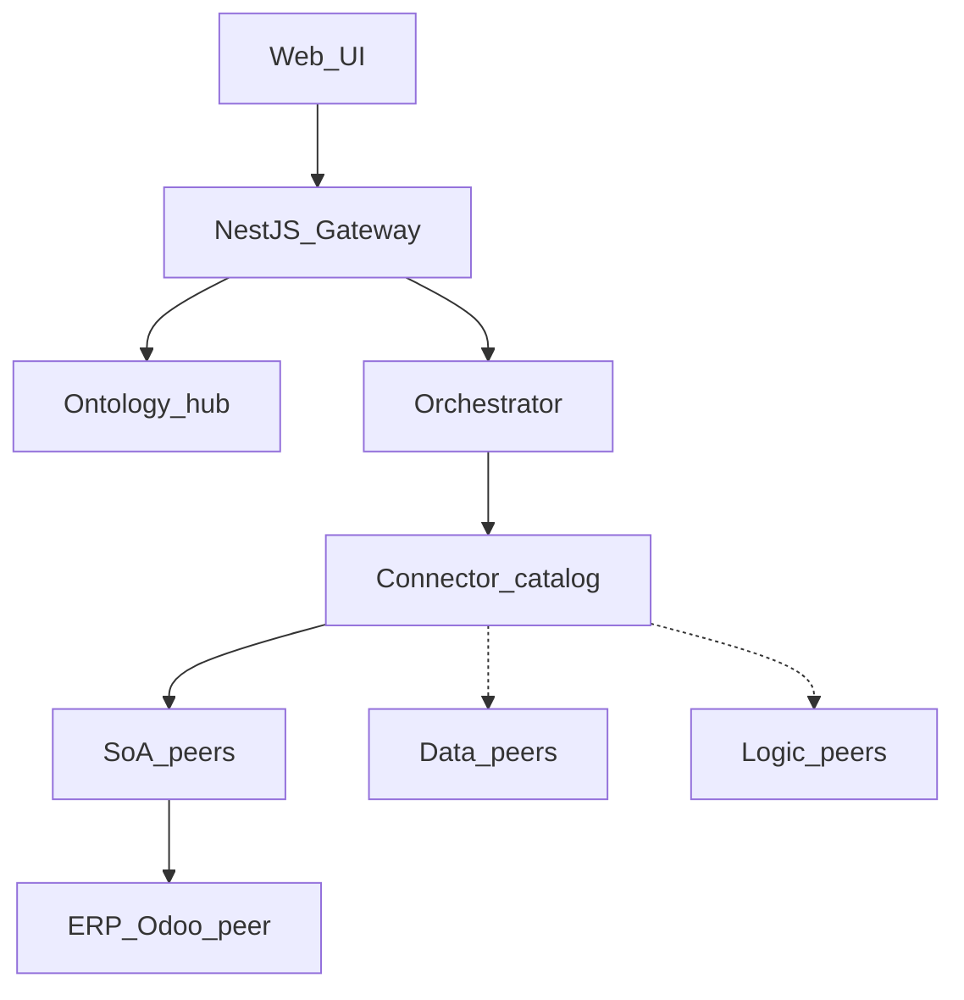

# Class / component diagram — OPS-001 live estimate via ERP SoA peer

Ontology hub + connector catalog. ERP is a **SoA peer**, not the sole edge.

```mermaid
flowchart TB
  UI[Web_UI] --> GW[NestJS_Gateway]
  GW --> Onto[Ontology_hub]
  GW --> Orch[Orchestrator]
  Orch --> Cat[Connector_catalog]
  Cat --> SoA[SoA_peers]
  Cat -.-> Data[Data_peers]
  Cat -.-> Logic[Logic_peers]
  SoA --> ERP[ERP_Odoo_peer]
```
