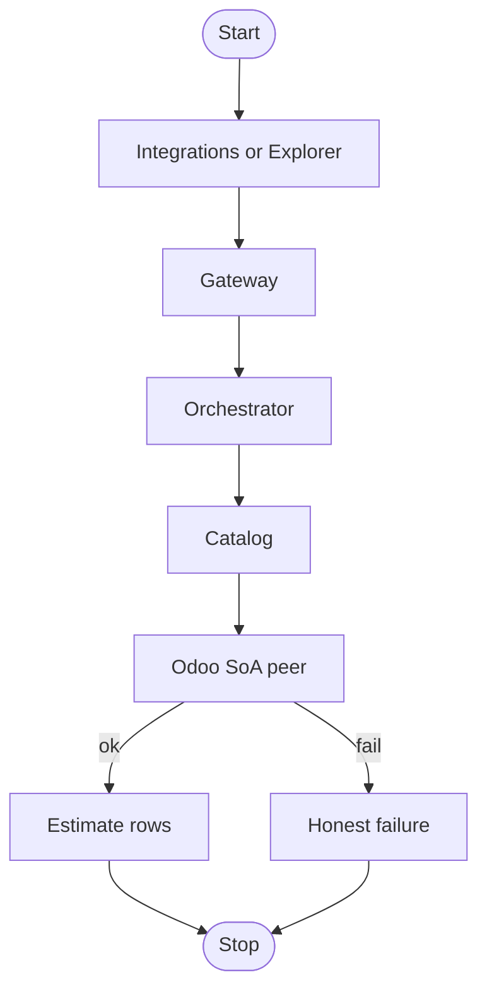

# Flow — OPS-001 live estimate via ERP SoA peer

```mermaid
flowchart TD
  Start([Start]) --> UI[Integrations or Explorer]
  UI --> GW[Gateway]
  GW --> Orch[Orchestrator]
  Orch --> Cat[Catalog]
  Cat --> Odoo[Odoo SoA peer]
  Odoo -->|ok| Rows[Estimate rows]
  Odoo -->|fail| Fail[Honest failure]
  Rows --> Stop([Stop])
  Fail --> Stop
```
