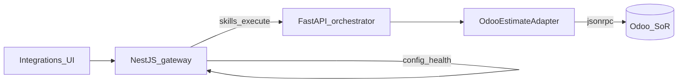

# SAC-005 — Technical Design (TSD)

How we reach the shop’s Odoo ERP without leaking vendor quirks into the UI or taxonomy.

Parent: [ControlPanelERP_TSD](../../TSD/ControlPanelERP_TSD.md) · Patterns: [Pattern_Selection](../../TSD/Pattern_Selection.md) · Skills engine: [SAC-004](../SAC-004/README.md)

## Model

1. **Browser** talks only to the NestJS gateway (Integrations UI + skills proxy).
2. **Gateway** stores/serves Odoo connector config; proxies `POST /skills/execute` to the orchestrator.
3. **Orchestrator** owns domain ports (`EstimatePort`, …) and **Odoo adapters** (JSON-RPC ACL).
4. **Binding YAML** under `resources/packages/ontology/bindings/odoo/` maps domain properties → vendor fields for adapters only — never returned on public ontology catalog APIs ([SAC-006](../SAC-006/TSD.md)).



## Patterns (locked)

| Concern | Pattern |
|---------|---------|
| Ports vs vendor | Hexagonal — `EstimatePort` |
| Vendor isolation | Anti-Corruption Layer + Adapter |
| Skill entry | Facade allowlist on orchestrator |
| Edge | API Gateway / BFF — no raw RPC to browser |
| Resilience | Circuit breaker + short retry on transport timeout |
| Status | Health Checks — `ok` \| `degraded` \| `down` |

## Env (`ODOO_*`)

Documented in root `.env.example`. Typical keys:

| Variable | Role |
|----------|------|
| `ODOO_URL` | Base URL (no trailing slash required; adapters normalize) |
| `ODOO_DB` | Database name (must match the Odoo instance — not a guess) |
| `ODOO_USERNAME` | Login user |
| `ODOO_PASSWORD` / `ODOO_API_KEY` | Secret (API key preferred) |
| `ODOO_MODE` | `live` or `simulate` (default simulate for safe local) |
| `ERP_MODE` | Optional alias; orchestrator accepts either |

Secrets stay in `.env` / later secret manager — never committed ([SAC-009 Secrets guide](../SAC-009/Guides/Secrets_and_Env.md)).

## Gateway — Integrations surface

| Piece | Choice |
|-------|--------|
| Routes | `GET/PUT /integrations/odoo`, `POST /integrations/odoo/test` |
| Web | `/integrations/odoo` — Save, Test, status badge |
| Storage | `OdooConnectorConfig` in control-plane Postgres; env fallback for local |
| GET | Mask secret; show whether configured |
| Test (live) | `common.version` + `authenticate` via JSON-RPC |
| Test (simulate) | Synthetic `ok` with simulated note |
| Actor | `X-Actor-Id` (dev default `dev-operator`) |

### Status mapping

| Condition | status |
|-----------|--------|
| Simulate mode | `ok` (note: simulated) |
| Version + auth succeed | `ok` |
| Version ok, auth fail | `degraded` |
| Unreachable / circuit open | `down` |

Prefer taxonomy error classes: `dependency_failure`, `validation_error`, `odoo_rejection`.

## Orchestrator — adapters

| Piece | Choice |
|-------|--------|
| Module | `apps/orchestrator/app/adapters/odoo_erp.py` |
| Port / DTOs | `EstimateReadQuery`, `EstimateRecord`, `EstimateReadResult` |
| Adapter | `OdooEstimateAdapter` — model `customer.estimate`, method `search_read` |
| Allowlist | `EXECUTE_ALLOWLIST["sales.estimate.read"]` in facade |
| Evidence | Written under storage root for correlation / audit |
| Shared RPC | JSON-RPC helper with circuit breaker + 1–2 retries on timeout |

### Call path (estimate read)

`sales.estimate.read` → gateway `POST /skills/execute` → orchestrator facade → `OdooEstimateAdapter` → `customer.estimate.search_read` → `POST …/jsonrpc`

### Contains filter

| Input | Behavior |
|-------|----------|
| `input.contains` (or `q` / `search`) | Domain: part name **or** description `ilike` |
| Empty | No text filter; default active estimates |

UI: Estimates → Read estimate → **Estimate contains** + Search / Clear.

### Simulate

When `ODOO_MODE=simulate`, adapter returns deterministic sample rows and a warning that live ERP data was not used.

## Binding YAML

```text
resources/packages/ontology/bindings/odoo/estimate.yaml
```

- `connector_id: odoo`
- `vendor_model: customer.estimate`
- `property_map` — domain property → Odoo field (ACL-side only)

Public `GET /ontology*` responses **omit** bindings.

## Connector SPI (product catalog)

| Rule | Detail |
|------|--------|
| Identity | `connector_id=odoo` for this integration |
| Ownership | Platform ships connectors one by one; no customer plugin loader |
| Capabilities | Each connector declares supported skill codes; gate UI/allowlist |
| Registry | Prefer a small in-code registry over a dynamic plugin system |
| UI | Keep `/integrations/odoo` until connector #2 ships (no multi-connector picker yet) |

## Hardening (later)

- Encryption-at-rest for secrets in Postgres (env preferred for local MVP)
- Tenant-scoped connector config when multi-tenant ships
- Broaden execute allowlist only with a new certified skill task

## Legacy sources

`_legacy/Epic-01` Odoo page · `_legacy/Epic-04` Odoo integration · `_legacy/Epic-05` live estimate read · `_legacy/Epic-06` connector SPI
