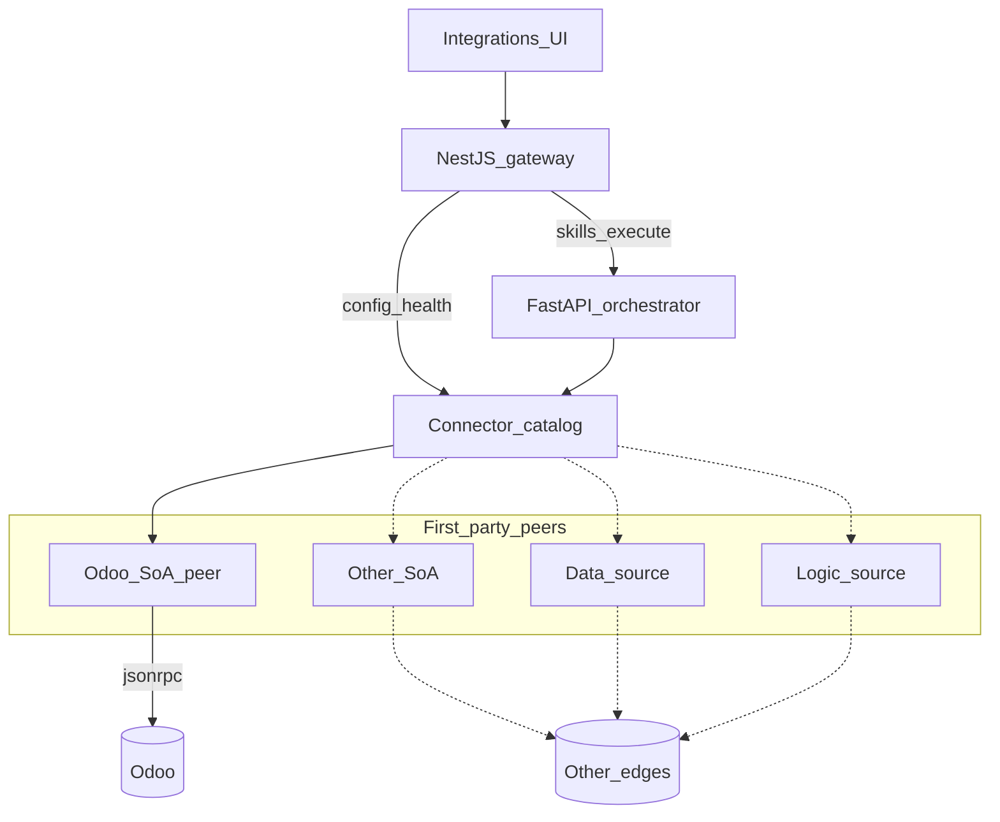

# SAC-005 — Technical Design (TSD)

**Connector catalog** for peer edges: systems of action (SoA), data sources, and logic sources. **Odoo is SoA peer #1** (`connector_id=odoo`) — not the architectural center.

Parent: [ControlPanelOntology_TSD](../../TSD/ControlPanelOntology_TSD.md) · Patterns: [Pattern_Selection](../../TSD/Pattern_Selection.md) · Skills: [SAC-004](../SAC-004/TSD.md) · Ontology bindings: [SAC-006](../SAC-006/TSD.md)  
**SRD:** SRD-CONN-*, SRD-SEC-005, SRD-EST-001, SRD-EDGE-002/003 · **OPS:** 001, 014, 015 (all Open)

## Model

1. **Browser / SDK** talks only to the NestJS gateway (Integrations UI + skills proxy).
2. **Gateway** stores/serves connector config; proxies `POST /skills/execute` to the orchestrator.
3. **Orchestrator** owns domain ports and **adapters** registered in the catalog (JSON-RPC ACL for Odoo today).
4. **Binding YAML** under `resources/packages/ontology/bindings/<connector_id>/` maps domain properties → vendor fields for adapters only — never on public ontology catalog APIs.



## Patterns (locked)

| Concern | Pattern |
|---------|---------|
| Ports vs vendor | Hexagonal — domain ports per use case |
| Vendor isolation | Anti-Corruption Layer + Adapter |
| Multi-peer catalog | Adapter registry (first-party) |
| Skill entry | Facade allowlist on orchestrator |
| Edge | API Gateway / BFF — no raw RPC to browser |
| Resilience | Circuit breaker + short retry on transport timeout |
| Status | Health Checks — `ok` \| `degraded` \| `down` |

## Connector SPI (product catalog)

| Field / rule | Detail |
|--------------|--------|
| `connector_id` | Stable id (`odoo`, future `mes`, …) |
| `kind` | `soa` \| `data` \| `logic` |
| Capabilities | Declared skill codes; gate UI/allowlist (**SRD-CONN-004**) |
| Health | Test connection → `ok` \| `degraded` \| `down` |
| Modes | `live` / `simulate` where the adapter supports it |
| Bindings | `bindings/<connector_id>/*.yaml` — ownership per property (**SRD-CONN-003**) |
| Ownership | Platform ships connectors; no customer plugin loader (**SRD-CONN-002**) |
| Registry | In-code registry preferred over dynamic plugins |

### Peers

| Peer | Status | OPS |
|------|--------|-----|
| `odoo` (SoA) | Implemented — estimate read, Integrations UI | OPS-001 |
| Other SoA | Catalog stub + same config/health pattern | OPS-014 |
| Data source | Binding path + read skill when shipped | OPS-015 |
| Logic source | Skill → logic adapter when shipped | (SAC-004 OPS-016) |

## Env (`ODOO_*` — SoA peer #1)

Documented in root `.env.example`.

| Variable | Role |
|----------|------|
| `ODOO_URL` | Base URL |
| `ODOO_DB` | Database name |
| `ODOO_USERNAME` | Login user |
| `ODOO_PASSWORD` / `ODOO_API_KEY` | Secret |
| `ODOO_MODE` | `live` or `simulate` |
| `ERP_MODE` | Optional alias |

Future peers use `<PEER>_*` env families behind the same SPI — not a second product.

## Gateway — Integrations surface

| Piece | Choice |
|-------|--------|
| Routes today | `GET/PUT /integrations/odoo`, `POST /integrations/odoo/test` |
| Target | Generalize to `/integrations/:connector_id` when peer #2 ships (OPS-014) |
| Web | `/integrations/odoo` — Save, Test, status badge |
| Storage | Connector config in control-plane Postgres; env fallback for local |
| GET | Mask secret; show whether configured |
| Actor | `X-Actor-Id` (dev default `dev-operator`) |

### Status mapping

| Condition | status |
|-----------|--------|
| Simulate mode | `ok` (note: simulated) |
| Version + auth succeed | `ok` |
| Version ok, auth fail | `degraded` |
| Unreachable / circuit open | `down` |

## Orchestrator — Odoo adapters (peer #1)

| Piece | Choice |
|-------|--------|
| Module | `apps/orchestrator/app/adapters/odoo_erp.py` |
| Port / DTOs | `EstimateReadQuery`, `EstimateRecord`, `EstimateReadResult` |
| Adapter | `OdooEstimateAdapter` — `customer.estimate.search_read` |
| Allowlist | `EXECUTE_ALLOWLIST["sales.estimate.read"]` |
| Evidence | Includes correlation + adapter provenance; prefer `connector_id=odoo` |

### Call path (estimate read — OPS-001)

`sales.estimate.read` → gateway `POST /skills/execute` → facade → catalog → `OdooEstimateAdapter` → JSON-RPC

### Simulate

When `ODOO_MODE=simulate`, deterministic sample rows + warning (not labeled live).

## Binding YAML

```text
resources/packages/ontology/bindings/odoo/estimate.yaml
resources/packages/ontology/bindings/<peer>/…   # future peers
```

- `connector_id`, `vendor_model`, `property_map` — ACL-side only  
- Public `GET /ontology*` **omit** bindings  
- Ownership inspect: Schema + binding docs (OPS-022)

## Data-source edge (OPS-015 — design target)

1. Add `kind=data` connector to registry.  
2. Author bindings for properties owned by that source.  
3. Register read skill; Explorer/skill returns business columns only.  
4. Keep scenario **Open** until TR evidence.

## Hardening (later)

- Encryption-at-rest for secrets in Postgres  
- Tenant-scoped connector config  
- Multi-connector picker UI when peer #2 ships  

## Related

- [OPS-001](./Scenarios/OPS-001.md) · [OPS-014](./Scenarios/OPS-014.md) · [OPS-015](./Scenarios/OPS-015.md)  
- [Component_Map](../../TSD/Component_Map.md) · [SAC-004](../SAC-004/TSD.md) · [SAC-006](../SAC-006/TSD.md)  
