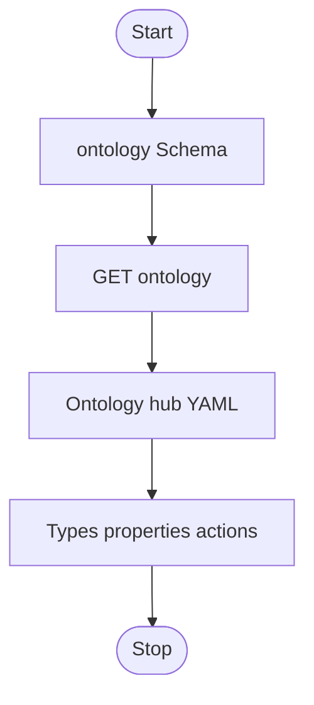

# Flow — OPS-004 schema browse

```mermaid
flowchart TD
  Start([Start]) --> Ont[ontology Schema]
  Ont --> GW[GET ontology]
  GW --> Pkg[Ontology hub YAML]
  Pkg --> View[Types properties actions]
  View --> Stop([Stop])
```
