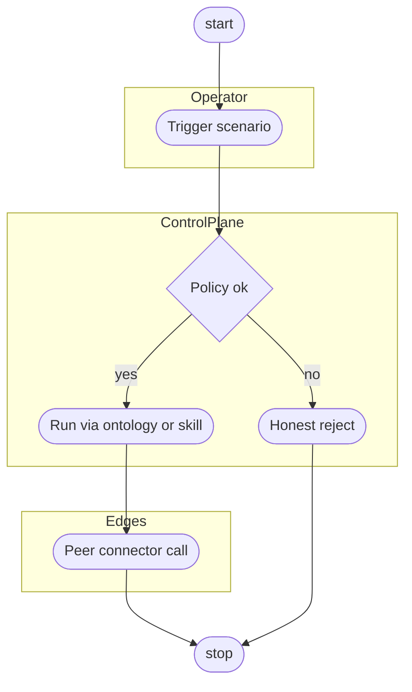

# Activity — OPS-005 explorer search

```mermaid
flowchart TB
  Start([start])
  subgraph Operator
    A1([Trigger scenario])
  end
  subgraph ControlPlane
    S1{Policy ok}
    S2([Run via ontology or skill])
    S3([Honest reject])
  end
  subgraph Edges
    E1([Peer connector call])
  end
  Stop([stop])
  Start --> A1 --> S1
  S1 -->|yes| S2 --> E1 --> Stop
  S1 -->|no| S3 --> Stop
```
