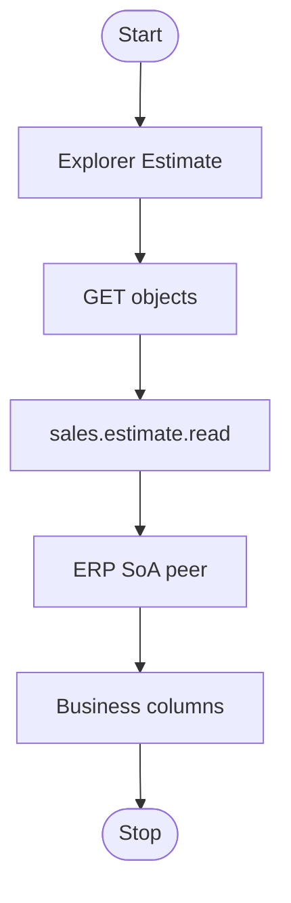

# Flow — OPS-005 explorer search

```mermaid
flowchart TD
  Start([Start]) --> Exp[Explorer Estimate]
  Exp --> GW[GET objects]
  GW --> Orch[sales.estimate.read]
  Orch --> Peer[ERP SoA peer]
  Peer --> Rows[Business columns]
  Rows --> Stop([Stop])
```
