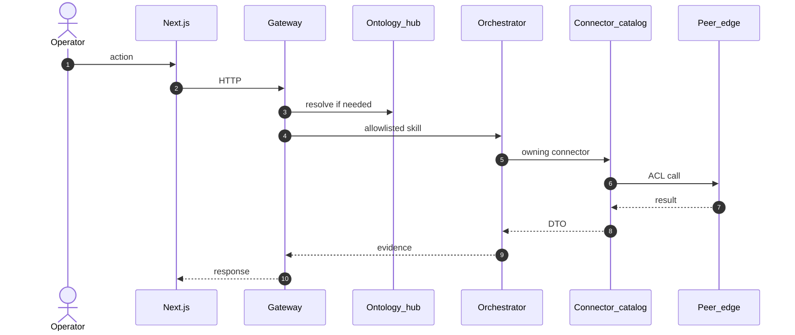

# Sequence — OPS-005 explorer search

```mermaid
sequenceDiagram
  autonumber
  actor Op as Operator
  participant UI as Next.js
  participant Gw as Gateway
  participant Onto as Ontology_hub
  participant Orch as Orchestrator
  participant Cat as Connector_catalog
  participant Edge as Peer_edge
  Op->>UI: action
  UI->>Gw: HTTP
  Gw->>Onto: resolve if needed
  Gw->>Orch: allowlisted skill
  Orch->>Cat: owning connector
  Cat->>Edge: ACL call
  Edge-->>Cat: result
  Cat-->>Orch: DTO
  Orch-->>Gw: evidence
  Gw-->>UI: response
```
