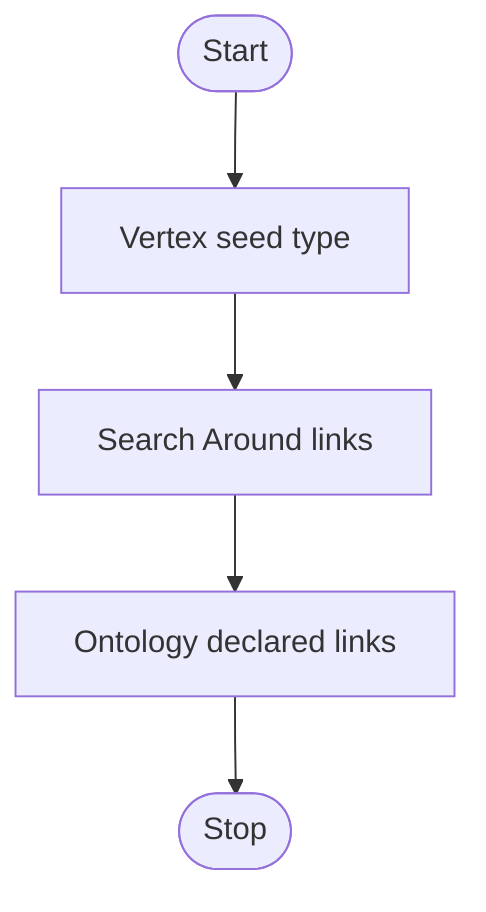

# Flow — OPS-006 vertex expand

```mermaid
flowchart TD
  Start([Start]) --> V[Vertex seed type]
  V --> Search[Search Around links]
  Search --> Schema[Ontology declared links]
  Schema --> Stop([Stop])
```
