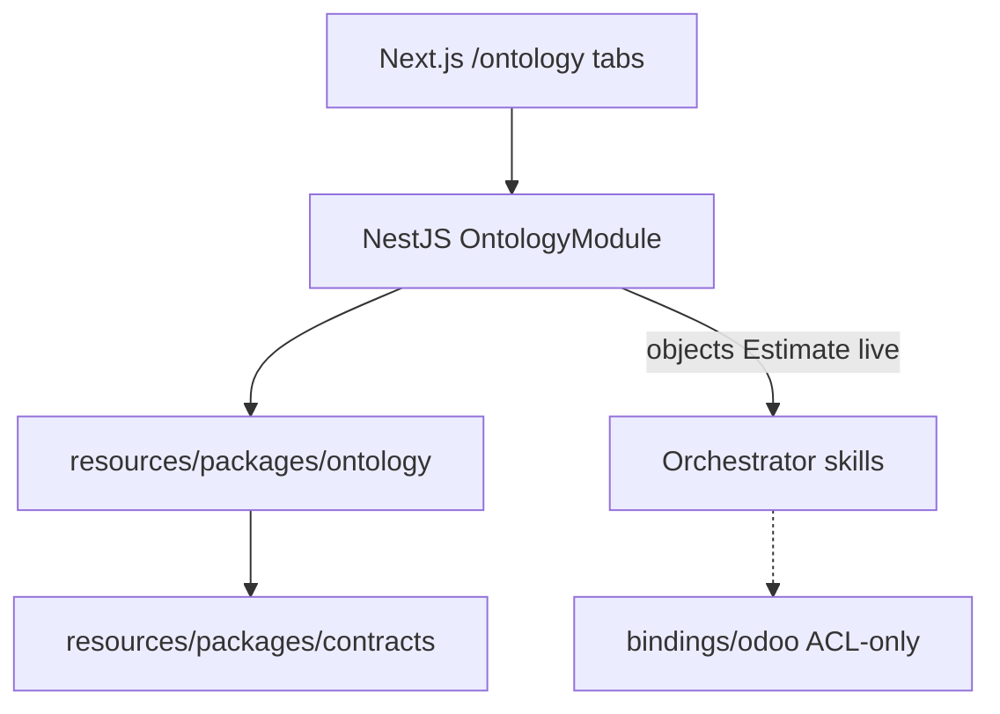

# SAC-006 — Technical Design (TSD)

How the business map is stored, served, and shown — without turning the control panel into a second ERP.

Parent: [ControlPanelERP_TSD](../../TSD/ControlPanelERP_TSD.md) · Patterns: [Pattern_Selection](../../TSD/Pattern_Selection.md) · Connector ACL: [SAC-005](../SAC-005/TSD.md)

## Model

1. **Language** lives in `resources/packages/ontology/` (npm workspace `@control-panel-erp/ontology`).
2. **Gateway** loads the package and serves read-only catalog + Explorer objects.
3. **Web** `/ontology` offers four tabs; browser never talks to Odoo RPC.
4. **Actions** point at taxonomy skill codes; execute still goes through gateway → orchestrator allowlist.



## Patterns (locked)

| Concern | Pattern |
|---------|---------|
| Business vocabulary | Domain Model — entity types |
| Control plane vs ERP | Bounded Context — ontology ≠ Odoo SoR |
| Vendor isolation | Anti-Corruption Layer — bindings |
| Intent / action route | Semantic Routing — UI → action → skill |
| Edge catalog | API Gateway + BFF |
| UI | Component-Based — Schema / Explorer / Vertex / Process |

## Package layout

```text
resources/packages/ontology/
  entity-types/          # Estimate, Contact, Sales Order, Inventory, …
  bindings/odoo/         # estimate.yaml — ACL field map only
  src/loadOntology.js
  src/index.js
  test/smoke.mjs
  package.json
  README.md
```

| Artifact | Role |
|----------|------|
| `entity-types/*.yaml` | id/label, properties, links, actions → `skill:` codes |
| `bindings/odoo/*.yaml` | `connector_id`, `vendor_model`, `property_map` — adapter private |
| Smoke test | YAML shape + action skills exist in contracts taxonomy |

**Docker:** gateway image must COPY `resources/packages/ontology` (and contracts) into the image so catalog APIs work in containers ([SAC-009](../SAC-009/TSD.md)).

### Estimate seed (v1)

| Piece | Value |
|-------|--------|
| Entity type | `Estimate` |
| Action `read` | skill `sales.estimate.read` |
| Action `find_issues` | skill `sales.estimate.find_issues` (catalogued; execute when allowlisted — [SAC-008](../SAC-008/README.md)) |
| Binding | `bindings/odoo/estimate.yaml` → `customer.estimate` |

## Gateway APIs

| Endpoint | Behavior |
|----------|----------|
| `GET /ontology` | List entity types + action summaries; **no** bindings |
| `GET /ontology/entity-types/:id` | Properties, links, actions for one type |
| `GET /ontology/objects?entity_type=&q=&limit=` | Explorer list — live Estimate via skills client when allowlisted; else demo stubs with `source: demo` and a clear note |

Module: `apps/gateway/src/ontology/` (`OntologyModule`, controller, service loading `@control-panel-erp/ontology`).

Headers: `X-Actor-Id`, `X-Correlation-Id` on objects path (dev default actor).

## Web UI

| Piece | Choice |
|-------|--------|
| Route | `apps/web/app/ontology/page.tsx` |
| Tabs | Schema · Explorer · Vertex · Process map |
| Schema | `OntologyManager` — search + inspector |
| Explorer | `OntologyObjectExplorer` — type pick, search, property layout |
| Vertex | `OntologyVertex` — seed + Search Around along schema links |
| Process map | `OntologyFlowMap` — curated spine; click node → actions panel |
| Nav | AppShell link; ERP Map remains primary launcher |

Authoring help on the page points at `resources/packages/ontology/entity-types/` and `bindings/<connector>/` — not in-browser editors.

## Relation to ERP Map (Epic-05 shell)

| Surface | Job |
|---------|-----|
| `/` ERP Map + `/sections/[slug]` | Pick modules and intents; run skills day to day |
| `/ontology` | Learn and browse the shared vocabulary and links |

Do not merge them into one screen in v1. Ontology does not host credentials or free-form RPC.

## Extending the map (builders)

1. Add/edit YAML under `entity-types/`.  
2. Add `bindings/<connector>/` when a connector must map fields.  
3. Register new `skill:` codes in `resources/packages/contracts`.  
4. `npm test -w @control-panel-erp/ontology`.  
5. Restart / reload gateway so `GET /ontology` picks up files.

## Deferred

- Instance graph / CDC / OSDK marketplace  
- Customer-authored Language  
- Multi-connector binding UI beyond Odoo  

## Legacy sources

`_legacy/Epic-07` Ontology Language + package + catalog UI · `_legacy/Epic-05` ERP Map / section shell (sibling nav)
