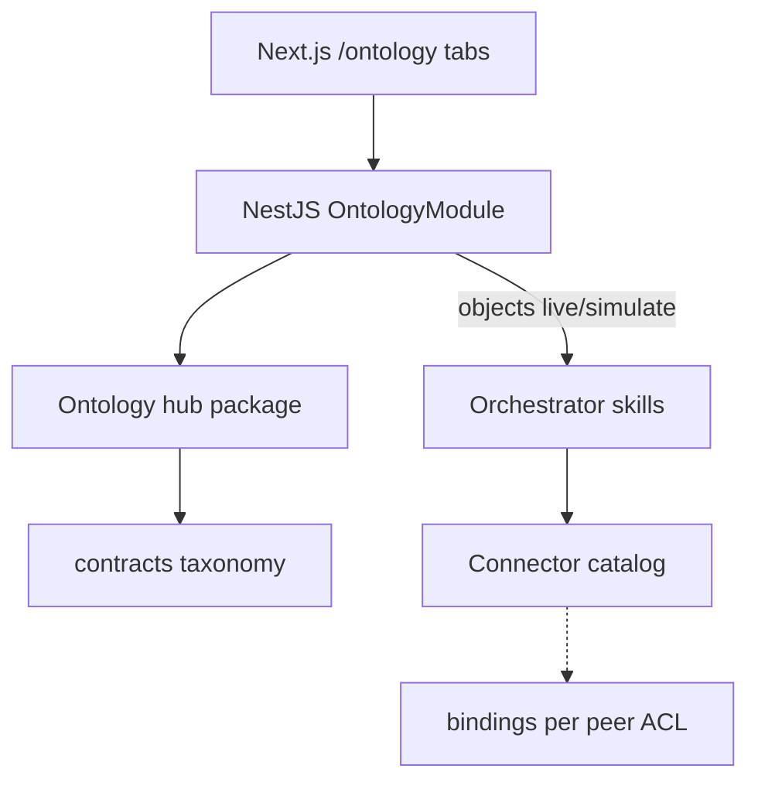
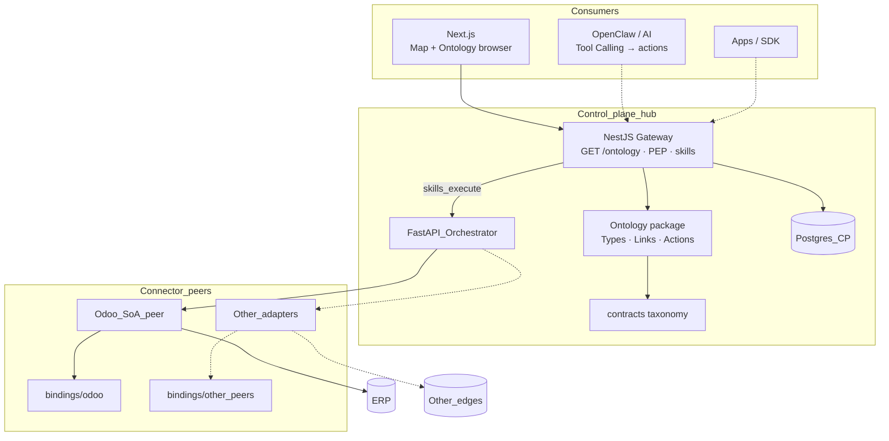

# SAC-006 — Technical Design (TSD)

How the business map is stored, served, and shown — the **ontology hub**. Edges (including ERP) attach via connectors; the panel is not a second ERP.

Parent: [ControlPanelOntology_TSD](../../TSD/ControlPanelOntology_TSD.md) · Patterns: [Pattern_Selection](../../TSD/Pattern_Selection.md) · Connector ACL: [SAC-005](../SAC-005/TSD.md)

## Model

1. **Language** lives in `resources/packages/ontology/` (npm workspace `@control-panel-ontology/ontology`).
2. **Gateway** loads the package and serves read-only catalog + Explorer objects.
3. **Web** `/ontology` offers four tabs; browser never talks to vendor RPC.
4. **Actions** point at taxonomy skill codes; execute still goes through gateway → orchestrator allowlist → owning connector peer.



## Patterns (locked)

| Concern | Pattern |
|---------|---------|
| Business vocabulary | Domain Model — entity types |
| Control plane vs edges | Bounded Context — ontology ≠ any single SoA database |
| Vendor isolation | Anti-Corruption Layer — bindings |
| Intent / action route | Semantic Routing — UI → action → skill |
| Edge catalog | API Gateway + BFF |
| UI | Component-Based — Schema / Explorer / Vertex / Process |

## Package layout

```text
resources/packages/ontology/
  entity-types/          # Estimate, Contact, Sales Order, Inventory, …
  bindings/odoo/         # SoA peer #1 — ACL field map only
  bindings/<peer>/       # future SoA / data / logic bindings
  src/loadOntology.js
  src/index.js
  test/smoke.mjs
  package.json
  README.md
```

| Artifact | Role |
|----------|------|
| `entity-types/*.yaml` | id/label, properties, links, actions → `skill:` codes |
| `bindings/odoo/*.yaml` | `connector_id`, `vendor_model`, `property_map` — adapter private |
| Smoke test | YAML shape + action skills exist in contracts taxonomy |

**Docker:** gateway image must COPY `resources/packages/ontology` (and contracts) into the image so catalog APIs work in containers ([SAC-009](../SAC-009/TSD.md)).

### Estimate seed (v1)

| Piece | Value |
|-------|--------|
| Entity type | `Estimate` |
| Action `read` | skill `sales.estimate.read` |
| Action `find_issues` | skill `sales.estimate.find_issues` (catalogued; execute when allowlisted — [SAC-008](../SAC-008/README.md)) |
| Binding | `bindings/odoo/estimate.yaml` → `customer.estimate` |

## Gateway APIs

| Endpoint | Behavior |
|----------|----------|
| `GET /ontology` | List entity types + action summaries; **no** bindings |
| `GET /ontology/entity-types/:id` | Properties, links, actions for one type |
| `GET /ontology/objects?entity_type=&q=&limit=` | Explorer list — live Estimate via skills client when allowlisted; else demo stubs with `source: demo` and a clear note |

Module: `apps/gateway/src/ontology/` (`OntologyModule`, controller, service loading `@control-panel-ontology/ontology`).

Headers: `X-Actor-Id`, `X-Correlation-Id` on objects path (dev default actor).

## Web UI

| Piece | Choice |
|-------|--------|
| Route | `apps/web/app/ontology/page.tsx` |
| Tabs | Schema · Explorer · Vertex · Process map |
| Schema | `OntologyManager` — search + inspector |
| Explorer | `OntologyObjectExplorer` — type pick, search, property layout |
| Vertex | `OntologyVertex` — seed + Search Around along schema links |
| Process map | `OntologyFlowMap` — curated spine; click node → actions panel |
| Nav | AppShell link; ERP Map remains primary launcher |

Authoring help on the page points at `resources/packages/ontology/entity-types/` and `bindings/<connector>/` — not in-browser editors.

## Estimate object (v1 seed)

| Piece | Value |
|-------|--------|
| Entity type | `Estimate` |
| Action `read` | skill `sales.estimate.read` |
| Action `find_issues` | skill `sales.estimate.find_issues` (catalogued; execute when allowlisted — [SAC-008](../SAC-008/README.md), GAP-02) |
| Binding | `bindings/odoo/estimate.yaml` → `customer.estimate` fields inside ACL only |



## Relation to Shop Map (SAC-002 shell)

| Surface | Job |
|---------|-----|
| `/` Map + `/sections/[slug]` | Pick modules and intents; run skills day to day |
| `/ontology` | Hub: vocabulary, links, ownership, Process spine |

Do not merge them into one screen in v1. Ontology does not host credentials or free-form RPC.

## Action → skill → connector (SRD-ONT-005)

| Artifact | Role |
|----------|------|
| `entity-types/*.yaml` `actions[]` | `skill:` code + label |
| `bindings/<connector_id>/` | Owning peer for properties / vendor map |
| Catalog capability matrix | Which connector may run which skill |
| Execute path | Gateway → orch → catalog-selected adapter (SAC-004 / SAC-005) |

Actions must not hard-code a single SoA in product requirements; Odoo is the first implemented peer.

## Process spine (OPS-021)

`OntologyFlowMap` shows curated Estimate→…→Ship stages. Each stage may later bind to different SoA peers via bindings — Process UI stays ontology-facing.

## Ownership inspect (OPS-022 / SRD-CONN-003)

| v1 | Later |
|----|--------|
| Document binding path + Schema property list; builders open YAML | Optional Schema inspector field: owning `connector_id` per property |
| Public catalog still omits raw vendor maps | Admin-only binding inspector if needed |

## Extending the map (builders)

1. Add/edit YAML under `entity-types/`.  
2. Add `bindings/<connector_id>/` when a peer must map fields.  
3. Register new `skill:` codes in `resources/packages/contracts`.  
4. `npm test -w @control-panel-ontology/ontology`.  
5. Restart / reload gateway so `GET /ontology` picks up files.

## Deferred

- Instance graph / CDC / OSDK marketplace  
- Customer-authored Language  
- Full multi-peer binding UI  

## Related

- [OPS-004](./Scenarios/OPS-004.md) · [OPS-005](./Scenarios/OPS-005.md) · [OPS-006](./Scenarios/OPS-006.md) · [OPS-021](./Scenarios/OPS-021.md) · [OPS-022](./Scenarios/OPS-022.md)  
- [Component_Map](../../TSD/Component_Map.md) · [SAC-002](../SAC-002/TSD.md) · [SAC-005](../SAC-005/TSD.md)  
