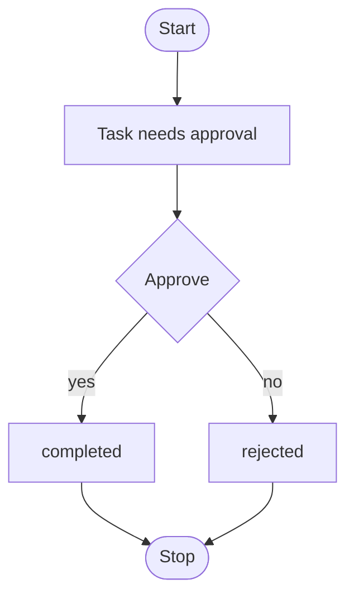

# Flow — OPS-003 approve/reject

```mermaid
flowchart TD
  Start([Start]) --> Needs[Task needs approval]
  Needs --> Human{Approve}
  Human -->|yes| Done[completed]
  Human -->|no| Rej[rejected]
  Done --> Stop([Stop])
  Rej --> Stop
```
