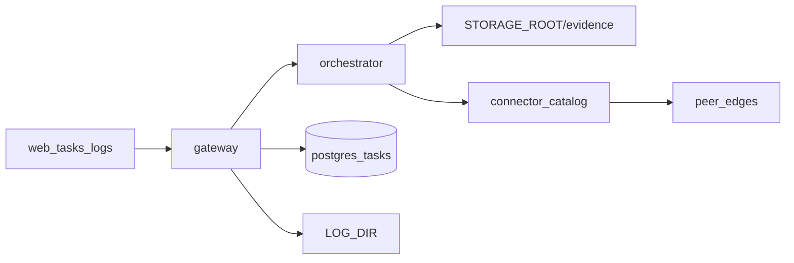

# SAC-007 — Technical Design (TSD)

How we keep shop work visible: a **task row** for every job, a **dry-run** that does not mutate peer edges, **automations** that reuse the same skill path (OPS-018), and **logs + evidence**.

Parent: [ControlPanelOntology_TSD](../../TSD/ControlPanelOntology_TSD.md) · Patterns: [Pattern_Selection](../../TSD/Pattern_Selection.md)  
**OPS:** 002, 003, 018 (all Open)

## Model

1. **Browser** talks only to the NestJS **gateway** (tasks, logs, console).
2. **Gateway** owns Prisma `Task` rows on control-plane Postgres; mints/accepts correlation; writes/reads logs under `LOG_DIR`.
3. **Orchestrator** (FastAPI) runs allowlisted dry-run skills; may write evidence under `STORAGE_ROOT/evidence/{correlation_id}/…`.
4. **Peer edges** stay behind the connector catalog; dry-run uses live reads or `simulate` — never a business commit on this path.



## Task entity (control-plane)

| Field | Role |
|-------|------|
| id, correlation_id, actor_id | Identity and trail |
| intent_code, skill_id | What was requested |
| state | `pending` \| `running` \| `completed` \| `failed` \| `needs_approval` \| `rejected` |
| execution_mode | `dry_run` \| `commit` (commit gated; no live mutate in dry-run epic) |
| input_json, output_json, error_json | Payloads + evidence blob |
| approved_by, approved_at | Human gate audit |

## APIs (gateway)

| Method | Path | Notes |
|--------|------|-------|
| GET | `/tasks?state=` | List / filter |
| GET | `/tasks/:id` | Detail |
| POST | `/tasks` | Create; auto-run dry-run when `execution_mode=dry_run` |
| POST | `/tasks/:id/approve` | From `needs_approval` to completed (commit still deferred) |
| POST | `/tasks/:id/reject` | From `needs_approval` to rejected |
| GET | `/logs?correlation_id=` | Log explorer backing store |

Orchestrator: `POST /skills/dry-run` with `{ intent_code, input, correlation_id, actor_id }`.

## Dry-run & evidence

| Piece | Choice |
|-------|--------|
| Evidence on task | `output` includes `predicted_effects`, `warnings`, `mode`, `odoo_mode` / provenance, `skill_id` |
| Evidence file | Optional under `STORAGE_ROOT/evidence/{correlation_id}/…` |
| Default root | `STORAGE_ROOT=./resources/storage/local` (see `.env.example`) |
| Path safety | Shared helper rejects traversal outside root |
| MVP skills (examples) | `inventory.stock.adjust`, `accounting.invoice.post` simulate … read/predict only |
| Commit lock | `execution_mode=commit` may land in `needs_approval`; do **not** call orchestrator commit until product unlocks it |

## Automations (OPS-018 / SRD-EDGE-005)

| Rule | Design |
|------|--------|
| Trigger | Task / job references known skill or ontology action |
| Path | Same gateway -> orchestrator allowlist as humans |
| Approval | Write skills still honor dry-run + `needs_approval` when policy requires |
| Forbidden | Automation cannot invent vendor RPC or bypass PEP |

## Logging

| Piece | Choice |
|-------|--------|
| Default dir | `LOG_DIR=./resources/logs` |
| Level | `LOG_LEVEL=info` (configurable) |
| Shape | JSON lines: timestamp, level, service, message, correlation_id, actor_id |
| Gateway | `StructuredLogger`, `CorrelationMiddleware`, `LogStoreService` (file + in-memory ring) |
| UI | Next.js `/logs` |
| Headers | `X-Correlation-Id`, `X-Actor-Id` (dev default `dev-operator`) |

## UI surfaces

| Route | Role |
|-------|------|
| `/tasks`, `/tasks/[id]` | Queue list + detail / approve-reject |
| `/logs` | Search by correlation id |
| `/console` | Create tasks; prefer dry-run for high-risk intents |

## Patterns (applied)

- API Gateway … browser never talks to Odoo or orchestrator directly  
- Correlation Identifier … one id across hops  
- Observability … structured logs + durable evidence beside them  
- Facade / Hexagonal / ACL … dry-run skills and ERP mapping live in orchestrator + connector (see SAC-004 / SAC-005)

## Env defaults (resources/)

```text
STORAGE_ROOT=./resources/storage/local
LOG_DIR=./resources/logs
LOG_LEVEL=info
ORCHESTRATOR_URL=http://localhost:8000
```

Compose bind-mounts for Linux later: [SAC-009 Guides](../SAC-009/Guides/Storage_and_Backups.md).

## Related

- [OPS-002](./Scenarios/OPS-002.md) · [OPS-003](./Scenarios/OPS-003.md) · [OPS-018](./Scenarios/OPS-018.md)  
- [SAC-001](../SAC-001/TSD.md) · [SAC-004](../SAC-004/TSD.md) · [SAC-009 Storage](../SAC-009/Guides/Storage_and_Backups.md)
