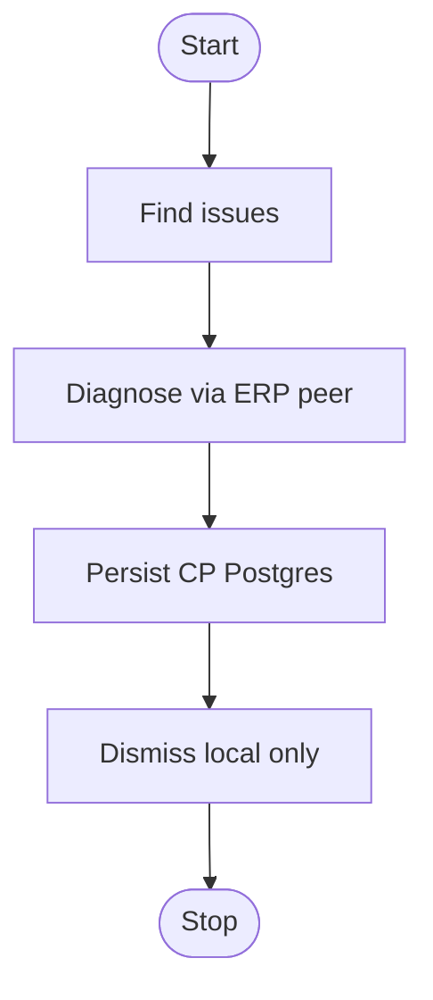

# Flow — OPS-011 estimate issues

```mermaid
flowchart TD
  Start([Start]) --> Find[Find issues]
  Find --> Orch[Diagnose via ERP peer]
  Orch --> PG[Persist CP Postgres]
  PG --> Dismiss[Dismiss local only]
  Dismiss --> Stop([Stop])
```
