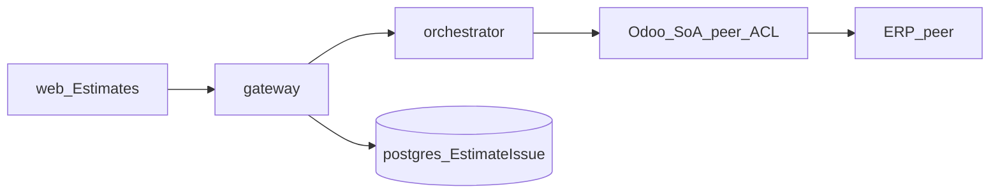

# SAC-008 — Technical Design (TSD)

How the estimate-issues wedge sits on the Estimates section and **ERP SoA peer** — diagnose in, dismiss local, never free-write the edge.

Parent: [ControlPanelOntology_TSD](../../TSD/ControlPanelOntology_TSD.md) · Patterns: [Pattern_Selection](../../TSD/Pattern_Selection.md)  
Status: **docs locked; runtime not started** ([GAP-02](../Risks.md)) · **OPS-011** Open

## Model

1. Operator opens **Estimates** (section shell / intent rail from Epic-05 / SAC-002).  
2. **Find issues** → gateway route → orchestrator skill/facade → **EstimatePort** diagnose on the Odoo adapter.  
3. Gateway **upserts** issue rows into control-plane Postgres.  
4. UI **lists** issues; **Dismiss** updates status in Postgres only.

## Stack (planned)

| Piece | Choice |
|-------|--------|
| Gateway | NestJS routes: find, list, dismiss |
| Orchestrator | Skill/facade → EstimatePort diagnose/search |
| Adapter | Existing Odoo estimate adapter (`customer.estimate` / estimate read family) |
| DB | `EstimateIssue` (or equivalent) on control-plane Postgres |
| Web | Next.js Estimates section — list, dismiss, find action |
| Connector | `odoo` only for this wedge |
| Modes | `ERP_MODE` / `ODOO_MODE`: `simulate` vs `live` |

## API sketch (planned)

| Method | Path (illustrative) | Notes |
|--------|---------------------|-------|
| POST | `/estimate-issues/find` (or tasks + skill) | Triggers find; returns count + correlation_id |
| GET | `/estimate-issues?status=` | List open / dismissed |
| POST | `/estimate-issues/:id/dismiss` | Control-plane status only |

Exact paths may align with task/skill patterns already used for dry-run; lock during implementation without inventing a second public ERP API.

## Data habits

- Upsert-by-signature for open issues  
- Reuse allowlist discipline from live estimate read (SAC-005); add a dedicated skill code when contracts extend  
- Optional evidence under `STORAGE_ROOT/evidence/{correlation_id}/` for the find run  
- UI copy from taxonomy — no `sale.order` style names in operator-facing strings

## Patterns (planned)

- Anti-Corruption Layer + Hexagonal — ERP shapes stay in the adapter  
- Facade — skill entry for diagnose  
- API Gateway — browser → gateway only  
- Correlation Identifier + Observability — same as SAC-007  
- Progressive disclosure — issues live inside Estimates, not a separate product  
- End-to-end path diagram: [Component_Map — Estimate issues](../../TSD/Component_Map.md#estimate-issues-path--patterns)

## Related

- [SAC-005](../SAC-005/README.md) live estimate read · [SAC-007](../SAC-007/README.md) tasks/logs · [OPS-011](./Scenarios/OPS-011.md)  
