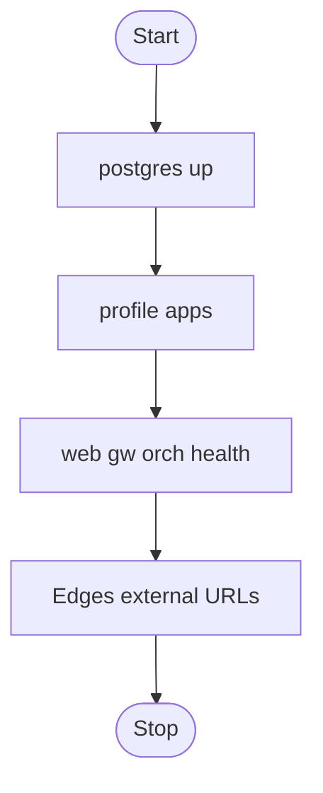

# Flow — OPS-007 compose bringup

```mermaid
flowchart TD
  Start([Start]) --> PG[postgres up]
  PG --> Apps[profile apps]
  Apps --> Health[web gw orch health]
  Health --> Edges[Edges external URLs]
  Edges --> Stop([Stop])
```
