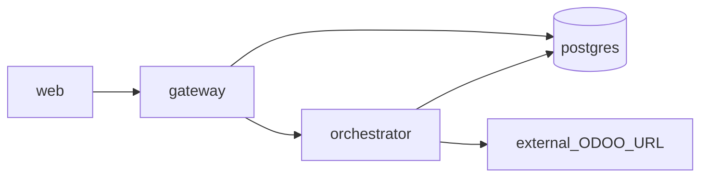

# SAC-009 — Technical Design (TSD)

How we run the control plane next to the shop’s ERP without putting the ERP in our containers.

## Model

1. **Local:** Docker Desktop / Engine + Compose; `docker/docker-compose.yml` + root `.env` from `.env.example`.
2. **Linux later:** Same Compose file; production `.env`; host bind mounts for `STORAGE_ROOT` and backups.
3. **v1:** Containers are the deployment unit — no separate non-Docker Linux path.

Parent: [ControlPanelERP_TSD](../../TSD/ControlPanelERP_TSD.md) · Patterns: [Pattern_Selection](../../TSD/Pattern_Selection.md) · Layout: [Monorepo_Layout](../../TSD/Monorepo_Layout.md).

## Environments

| Env | Notes |
|-----|--------|
| local | Developers copy `.env.example` → `.env`; Postgres via Compose; apps via npm or `--profile apps` |
| linux | Docker Engine + Compose; same file; stronger secrets; host mounts for storage/backups |

## Containers

| Service | Image / build | Public? | Role | Default |
|---------|---------------|---------|------|---------|
| `postgres` | postgres:16 | no | Control-plane DB (host port **5433**) | starts with `compose up` |
| `gateway` | Dockerfile.gateway | yes (API) | NestJS BFF — auth stub, rate limit, ontology, tasks | profile `apps` |
| `orchestrator` | Dockerfile.orchestrator | **no** | FastAPI skills; retry/circuit toward connectors | profile `apps` |
| `web` | Dockerfile.web | yes (UI) | Next.js control panel | profile `apps` |
| Redis | — | — | Omit unless shared rate-limit/queue across replicas is required | omitted |
| Odoo / other SoRs | external | — | Via connector env URLs | not in Compose |

**Image rule:** `Dockerfile.gateway` must COPY `resources/packages/ontology` (+ contracts) into the image.

## Dependency graph

- `web` → `gateway`
- `gateway` → `orchestrator` and `postgres`
- `orchestrator` → `postgres` and external connector URLs (Odoo is **not** in Compose)



## Commands (summary)

```bash
# Postgres only
docker compose -f docker/docker-compose.yml up -d

# Full apps profile
docker compose -f docker/docker-compose.yml --profile apps up -d --build

docker compose -f docker/docker-compose.yml down
```

Full ordered checklist: [Guides/Compose_and_Runbook.md](./Guides/Compose_and_Runbook.md).

## Secrets and storage

- Categories and rules: [Guides/Secrets_and_Env.md](./Guides/Secrets_and_Env.md)
- Volumes / backups sketch: [Guides/Storage_and_Backups.md](./Guides/Storage_and_Backups.md)
- `NODE_AUTH_TOKEN` is for patterns docs sync only — not Compose runtime

## Hardening (later)

- Non-root users in Dockerfiles  
- Healthchecks on gateway / orchestrator / web  
- Resource limits  
- Secrets via files or secret manager  
- Publish only web + gateway (+ external TLS proxy); orchestrator internal  
- Tenant-aware `DATABASE_URL` / migrations when multi-tenant ships  
- Optional Traefik/nginx/Cloudflare for TLS/WAF — **not** a second Nest gateway  

## Legacy sources

`_legacy/Epic-01` docker + storage · `_legacy/Epic-02` postgres · `_legacy/Epic-04` storage
