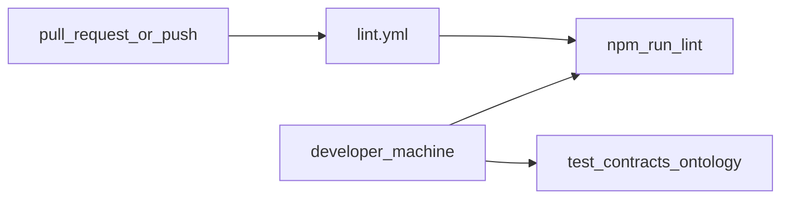

# SAC-010 — Technical Design (TSD)

What the repo **actually** runs for quality gates, and what we **intend** next — no phantom pipelines. Release must not close Open OPS/E rows without evidence (**SRD-CI**, E-05 / E-06).

Parent: [ControlPanelOntology_TSD](../../TSD/ControlPanelOntology_TSD.md) · Layout: [Monorepo_Layout](../../TSD/Monorepo_Layout.md).

## Current CI

### Workflow: Lint

File: [`.github/workflows/lint.yml`](../../../../.github/workflows/lint.yml)

| Item | Value |
|------|--------|
| Triggers | `push` to `main` / `master`; all `pull_request` |
| Runner | `ubuntu-latest` |
| Node | 20 |
| Install | `npm ci` (GitHub Packages auth via `NODE_AUTH_TOKEN` for scoped patterns package) |
| Command | `npm run lint` |

There are **no other** workflows under `.github/workflows/` at this writing (no contracts job, no Docker build job, no release job).

### Root scripts (local / checklist)

From root `package.json`:

| Script | Role |
|--------|------|
| `npm run lint` | `markdownlint` over docs, apps, packages, docker, `.github` markdown, READMEs |
| `npm run test:contracts` | Workspace test for `@control-panel-ontology/contracts` |
| `npm run test:ontology` | Workspace test for `@control-panel-ontology/ontology` |
| `npm run docs:sync-patterns` | Patterns docs sync (needs `NODE_AUTH_TOKEN`) — **not** a CI gate today |

## Planned (honest backlog)

| Item | Notes |
|------|--------|
| CI steps for `test:contracts` / `test:ontology` | Same Node setup as Lint; fail PR on red smoke |
| Gateway / web / orchestrator tests | Add when meaningful suites exist |
| Optional Compose smoke | Could reuse OPS-007 checks — not automated yet |
| Release workflow | Tag → attach lint + smoke logs + pointer to TestPlans reports |

## Release evidence expectations (manual until automated)

When cutting a version operators/developers care about:

1. Lint workflow green (or attach lint log).  
2. Run and keep output of `npm run test:contracts` and `npm run test:ontology`.  
3. For claimed capabilities, point at matching `TP-OPS-*` / `TP-E-*` reports — scenarios stay **Open** until TR exists (E-05).  
4. Failed required verification **blocks** release (E-06).  
5. Confirm no secrets in the tree being tagged.

## Related

- Root `package.json` scripts (`lint`, `test:contracts`, `test:ontology`)  
- Live workflow: `.github/workflows/lint.yml`  
- [E-01](../Scenarios/E-01.md) … [E-03](../Scenarios/E-03.md) · [E-05](./Scenarios/E-05.md) · [E-06](./Scenarios/E-06.md) · [E-07](../Scenarios/E-07.md) · [E-08](../Scenarios/E-08.md) · [Parent TSD](../../TSD/ControlPanelOntology_TSD.md)
