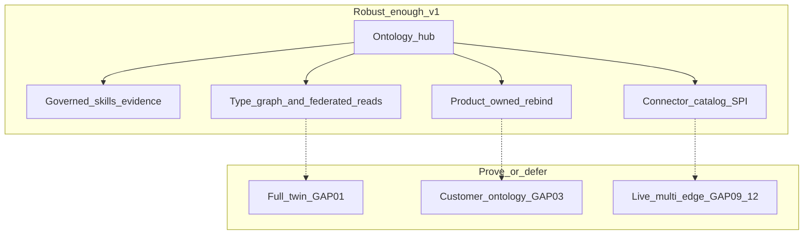

# Capability model — robust enough without over-building

**Product:** ControlPanelOntology  
**Pairs with:** [ConOps](../ConOps/ControlPanelOntology_ConOps.md) · [SRD](../SRD/ControlPanelOntology_SRD.md) · [Risks](../Subsystem/Risks.md) · [Component_Map](./Component_Map.md)

This document locks what **“robust enough”** means: strong enough to sell and replicate as a **Foundry-shaped control plane**, without promising a Palantir twin, customer ontology marketplace, or every edge live on day one.

---

## 1. Three strategic choices (explicit)

| Choice | We compete on | We defer (see Risks) |
|--------|----------------|----------------------|
| **Multi-edge** | One hub, one skill path, **connector catalog SPI**, per-binding ownership, simulate/live per peer | Every peer live in v1 (GAP-09…12 until proven) |
| **No full twin** | **Governed operations** + **type-level exploration** (Schema / Explorer / Vertex / Process) + **federated reads** via skills | CDC instance graph, path queries at scale (GAP-01) |
| **Product-owned ontology** | **Re-bind** entity types + bindings + connectors for another company (same hub) | Customer browser authoring / marketplace (GAP-03) |

---

## 2. Architectural invariants (must hold in code and docs)

These are **non-negotiable** even when only Odoo is live.

| ID | Invariant | Why it matters |
|----|-----------|----------------|
| **INV-01** | Ontology action or known intent → **allowlisted skill** → **capable `connector_id`** (never hard-coded “always Odoo” in product contracts) | Multi-edge ready; OPS-013 |
| **INV-02** | Public ontology APIs **omit** vendor bindings; ACL maps live under `bindings/<connector_id>/` | Security + anti-corruption; OPS-015, 022 |
| **INV-03** | Browser and SDK call **gateway only**; no embedded peer credentials | EDGE-006; OPS-019 |
| **INV-04** | Dry-run / approve / evidence on **writes**; correlation + actor (+ connector when used) on skill paths | Governed ops; not twin |
| **INV-05** | **Connector catalog** declares peer **kind** (SoA / data / logic) and **supported skills** | OPS-014; GAP-09 |
| **INV-06** | Control-plane Postgres ≠ peer business stores; Compose does not host ERP/MES | SAC-009 |

Parent SHALLs: **SRD-ARCH-001…004** in [ControlPanelOntology_SRD.md](../SRD/ControlPanelOntology_SRD.md).

---

## 3. Multi-edge — specified vs proven (proof ladder)

Architecture is **multi-edge now**; **live** peers beyond ERP are **staged**.

| Stage | What “done” means | Scenarios / gaps |
|-------|-------------------|------------------|
| **M0 (today)** | Odoo SoA live/simulate; catalog lists peers; bindings name `connector_id`; skills facade uses ports | OPS-001, 008; wedge |
| **M1** | Second SoA peer in **simulate** (health + capability matrix + one skill) | OPS-014 · GAP-09 |
| **M2** | Data-source binding on one property; public API still clean | OPS-015 · GAP-10 |
| **M3** | Logic-source action → skill → logic adapter (simulate OK) | OPS-016 · GAP-11 |
| **M4** | Automation trigger uses **same** gateway skill path as humans | OPS-018 · GAP-12 |
| **M5** | Action on ontology object targets **non-default** owning connector in live mode | OPS-013 |

**Robust enough for market narrative at M0–M1:** “**Full manufacturing ontology** and multi-peer catalog — not an estimate SKU or ERP-only hub. Reference shop has **first live SoA** on Odoo; next peer and next skills ship through the same catalog and bindings, not a fork.”

Catalog stub (product-owned): [`resources/packages/ontology/catalog/connectors.yaml`](../../../resources/packages/ontology/catalog/connectors.yaml).

---

## 4. Observation without a full twin (GAP-01 boundary)

We **do not** compete on “live digital twin of the plant.” We **do** compete on **operational truth + exploration** at bounded cost.

| Capability | What the shop gets | Not claiming |
|------------|-------------------|--------------|
| **Schema** | Product-owned types, links, actions | Customer edits ontology in browser |
| **Explorer** | Object lists via **skills** (live or labeled demo) | Cross-system materialized index of every row |
| **Vertex** | **Type-level** Search Around along declared links | Instance graph simulation / CDC |
| **Process map** | Curated Estimate → … → Ship spine | Auto-layout of all ERP links |
| **Evidence + tasks** | Preview, approve, audit trail | Time-travel replay of entire SoR |
| **Federated read** | Each read goes to **owning peer** through ACL | Single queryable twin DB |

**Robust enough:** a buyer can run daily work (read estimates, preview writes, browse the map) and trust governance **without** buying a graph engine.

When GAP-01 closes later, it **extends** observation — it does not replace the hub or allowlist model.

---

## 5. Replicability without customer Foundry (GAP-03 boundary)

**Single-tenant, product-owned ontology** is a **feature** for SMB: supportable, allowlisted, auditable.

| Mechanism | Who | Output |
|-----------|-----|--------|
| **Deployment profile** | Product / integrator | Chooses entity types, connectors, env, Map sections |
| **Rebind packages** | Product team | New `entity-types/*`, `bindings/<connector>/*`, connector catalog rows |
| **Taxonomy + contracts sync** | Product team | SAC-003 Authoring → packages |
| **Verify** | V&V | Same OPS/E pattern; reference shop scenarios + customer-specific TR |

**Robust enough for another manufacturer:** new company = **new bindings and connectors**, not a new control plane. Optional vertical packs from [SRD-Candidates](../Subsystem/SRD-Candidates.md) (MFG, QC, DOC, SHIP, INV).

**Not robust enough for:** self-serve PLG where each tenant edits ontology in the UI (GAP-03). That is a **different product lane**; do not blur with replicability.

### Packaging (SaaS vs dedicated) — specified, not fully built

| Offer | Mode | Multi-tenant features | Pricing |
|-------|------|------------------------|---------|
| **SaaS** | `multi_tenant` | ON (isolation/admin → GAP-13) | Subscription |
| **Dedicated** | `single_tenant` | OFF | License + deploy |

Same hub; SKU chooses entitlements. [Product_Packaging_Tenancy](../Guides/Product_Packaging_Tenancy.md) · OPS-023 / OPS-024 **Open**.

---

## 6. “Robust enough” checklist (release / demo)

Before calling the architecture **market-ready** (not the same as closing all scenarios):

- [ ] ConOps + Capability_Model + Risks tell one story (this file linked from pack README)
- [ ] At least **one live SoA** path (Estimate read) + **simulate** when peer down
- [ ] Connector **catalog** artifact lists ≥2 peers (one live-capable, one simulate stub)
- [ ] Schema / Explorer / Vertex / Process usable without twin
- [ ] Allowlist + dry-run + correlation demonstrated on a write intent
- [ ] Docs state GAP-01 / GAP-03 / GAP-09…12 honestly; OPS stay Open until TR

---

## Related

- [Wedge_Demo_and_Replication](../Guides/Wedge_Demo_and_Replication.md) — sales/demo playbook when story runs ahead of TR  
- [Pattern_Selection](./Pattern_Selection.md) — how we implement invariants  
- [TestPlans](../TestPlans/README.md) — proof ladder per scenario  
- [SRVM](../SRVM/ControlPanelOntology_SRVM.md) — closure only with evidence  
