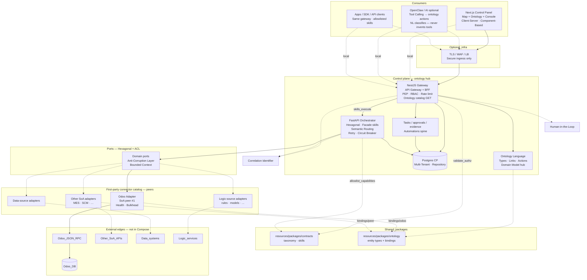
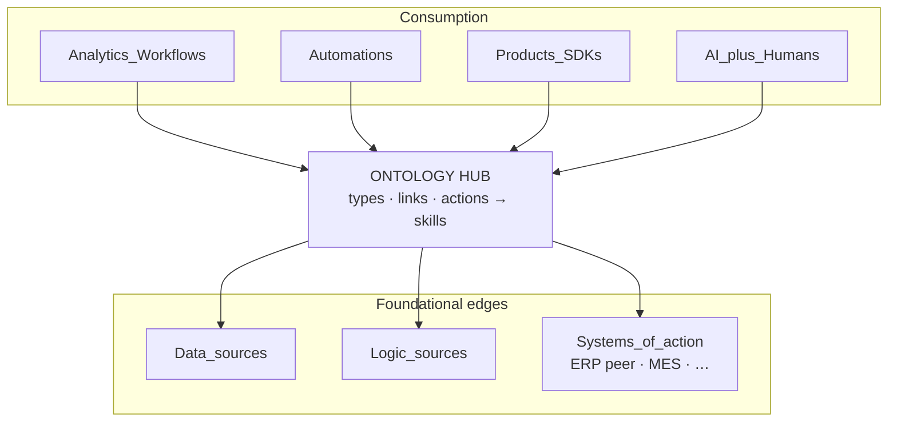
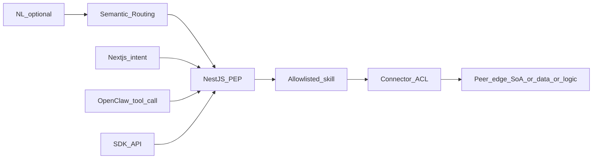
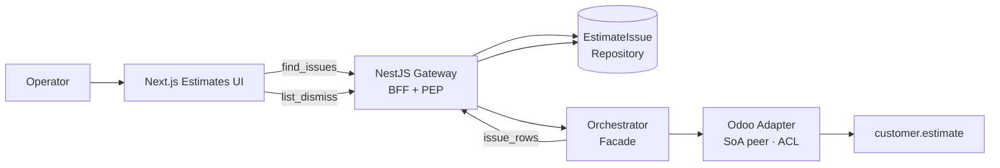
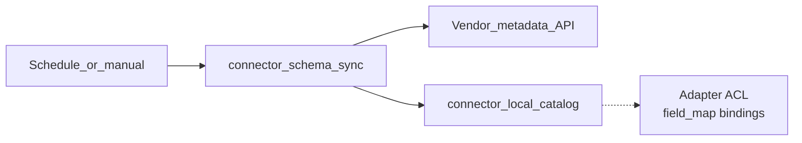

# Component map — Control Panel

How clients, the **ontology hub**, control-plane services, the **first-party connector catalog**, Postgres, and **peer edges** connect.

**Edges:** systems of action (SoA), data sources, and logic sources. **ERP (Odoo) is SoA peer #1**, not the architectural center. More connectors plug the same ports.

**Edge ingress:** NestJS `apps/gateway` **is** the API Gateway — auth, tenancy, rate limits, contract validation. Do not add a second application gateway; optional TLS/WAF only.

**Patterns:** [Pattern_Selection](./Pattern_Selection.md) · **Robust enough:** [Capability_Model](./Capability_Model.md) · **NL vs skills:** [ConOps](../ConOps/ControlPanelOntology_ConOps.md) · **Ontology:** [SAC-006](../Subsystem/SAC-006/README.md) · **Connectors:** [SAC-005](../Subsystem/SAC-005/README.md)

Parent: [ControlPanelOntology_TSD](./ControlPanelOntology_TSD.md)

## Pattern-annotated component map

## Hub vs edges (context)

## Pattern legend (by layer)

| Layer | Primary patterns |
|-------|------------------|
| **Next.js (`apps/web`)** | [Client-Server](../../Software%20Patterns%20Docs/Architectural%20Patterns/01-client-server.md), [Component-Based Architecture](../../Software%20Patterns%20Docs/Frontend_patterns/06-component-based-architecture.md), [Observer](../../Software%20Patterns%20Docs/Frontend_patterns/08-observer.md), [State Container](../../Software%20Patterns%20Docs/Frontend_patterns/09-state-container.md) (light); Map + intent rail + `/ontology`; **only** talks to NestJS BFF |
| Agents / SDK | [Tool Calling](../../Software%20Patterns%20Docs/AI_Agentic_patterns/03-tool-calling.md) — same gateway; NL classifies only ([ConOps](../ConOps/ControlPanelOntology_ConOps.md)) |
| Edge | Optional TLS only — **not** a second [API Gateway](../../Software%20Patterns%20Docs/Distributed_system_patterns/01-api-gateway.md) |
| NestJS gateway | [API Gateway](../../Software%20Patterns%20Docs/Distributed_system_patterns/01-api-gateway.md), [BFF](../../Software%20Patterns%20Docs/Architectural%20Patterns/21-backend-for-frontend-bff.md), [PEP](../../Software%20Patterns%20Docs/Security_patterns/16-policy-enforcement-point.md), [RBAC](../../Software%20Patterns%20Docs/Security_patterns/02-rbac.md), [JWT](../../Software%20Patterns%20Docs/Security_patterns/08-jwt.md), [Rate Limiting](../../Software%20Patterns%20Docs/Distributed_system_patterns/18-rate-limiting.md), [Fail Fast](../../Software%20Patterns%20Docs/Resilience_Pattern/05-fail-fast.md), [Human-in-the-Loop](../../Software%20Patterns%20Docs/AI_Agentic_patterns/09-human-in-the-loop.md) |
| **Ontology Language** | [Domain Model](../../Software%20Patterns%20Docs/Data_domain_patterns/14-domain-model.md), [Bounded Context](../../Software%20Patterns%20Docs/Org_System_Engineering_patterns/02-bounded-context.md), [Semantic Routing](../../Software%20Patterns%20Docs/AI_Agentic_patterns/12-semantic-routing.md) — actions → skills ([SAC-006](../Subsystem/SAC-006/README.md)) |
| Orchestrator | [Hexagonal](../../Software%20Patterns%20Docs/Architectural%20Patterns/05-hexagonal-architecture.md), [Facade](../../Software%20Patterns%20Docs/Structural%20Patterns/Facade.md), [Semantic Routing](../../Software%20Patterns%20Docs/AI_Agentic_patterns/12-semantic-routing.md), [Retry with Backoff](../../Software%20Patterns%20Docs/Distributed_system_patterns/04-retry-with-backoff.md), [Circuit Breaker](../../Software%20Patterns%20Docs/Distributed_system_patterns/02-circuit-breaker.md), [Timeout](../../Software%20Patterns%20Docs/Resilience_Pattern/03-timeout.md), [Idempotency](../../Software%20Patterns%20Docs/Distributed_system_patterns/20-idempotency.md) |
| Ports / connectors | [Anti-Corruption Layer](../../Software%20Patterns%20Docs/Distributed_system_patterns/15-anti-corruption-layer.md), [Adapter](../../Software%20Patterns%20Docs/Structural%20Patterns/Adapter.md), [Bounded Context](../../Software%20Patterns%20Docs/Org_System_Engineering_patterns/02-bounded-context.md), [Bulkhead](../../Software%20Patterns%20Docs/Distributed_system_patterns/05-bulkhead.md), [Health Checks](../../Software%20Patterns%20Docs/DevOps_Delivery_patterns/09-health-checks.md), [Fallback](../../Software%20Patterns%20Docs/Resilience_Pattern/07-fallback.md) (`simulate`) |
| Data | [Database per Service](../../Software%20Patterns%20Docs/Distributed_system_patterns/32-database-per-service.md), [Multi-Tenant Partitioning](../../Software%20Patterns%20Docs/Data_domain_patterns/21-multi-tenant-partitioning.md), [Repository](../../Software%20Patterns%20Docs/Data_domain_patterns/01-repository.md) |
| Cross-cutting | [Correlation Identifier](../../Software%20Patterns%20Docs/Messaging_Integration_patterns/19-correlation-identifier.md), [Observability](../../Software%20Patterns%20Docs/DevOps_Delivery_patterns/06-observability.md), [Defense in Depth](../../Software%20Patterns%20Docs/Security_patterns/09-defense-in-depth.md) |
| Around edges | [Strangler Fig](../../Software%20Patterns%20Docs/Distributed_system_patterns/13-strangler-fig.md) — grow governed skills without replacing peer SoAs |

## Connector boundary

| Above (stable) | Below (per connector we ship) |
|----------------|-------------------------------|
| Ontology actions, taxonomy intents, ports, allowlist, evidence | Auth, transport, payloads, modules/fields |
| Capability matrix · per-property ownership | Schema sync implementation |
| Tenant: enable connector + credentials | Health probe details |

Customers do not implement adapters. Detail: [SAC-005](../Subsystem/SAC-005/README.md).

## NL / OpenClaw vs free-form execution

LLM may **route**; certified skills **execute**. Full rationale: [ConOps](../ConOps/ControlPanelOntology_ConOps.md).

## Estimate issues path — patterns

Owned by [SAC-008](../Subsystem/SAC-008/README.md). Runtime still deferred ([GAP-02](../Subsystem/Risks.md)). Uses the **ERP SoA peer** for estimate reads; issues live in the control plane.

## Schema catalog path (per SoA connector)

Odoo implements this first (`fields_get` → local catalog). Other SoA peers reuse the same pattern when shipped.
