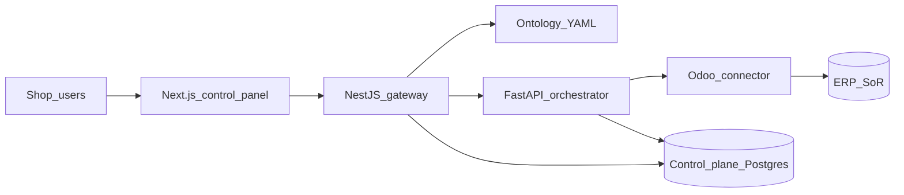

# ControlPanelERP — Technical System Design (parent TSD)

**Status:** Draft 0.1  
**Pairs with:** [ConOps](../ConOps/ControlPanelERP_ConOps.md) · [SRD](../SRD/ControlPanelERP_SRD.md) · [Pattern_Selection](./Pattern_Selection.md)

## 1. Picture of the system

Plain language: the browser talks only to the **gateway**. The gateway may show the **business map**, run **skills**, or create **tasks**. The **orchestrator** talks to the ERP through a **connector**. Real job data stays in the ERP database.

## 2. Layers

| Layer | Where | Job |
|-------|-------|-----|
| UI | `apps/web` | ERP Map, intents, ontology tabs, console/tasks/logs |
| Gateway (BFF) | `apps/gateway` | Auth stub, allowlist, ontology APIs, skills/tasks |
| Ontology Language | `resources/packages/ontology` | Entity types, links, actions → skills |
| Contracts | `resources/packages/contracts` | Taxonomy skill codes |
| Orchestrator | `apps/orchestrator` | Facade, adapters, evidence |
| Data | Postgres | Tasks, audits, connector config — not ERP twin |
| Runtime | Docker Compose | Postgres by default; profile `apps` for web/gateway/orch |

## 3. Key interfaces

| Call | Purpose |
|------|---------|
| `GET /ontology` | List business types |
| `GET /ontology/entity-types/:id` | One type detail |
| `GET /ontology/objects` | Explorer — live Estimate or demo rows |
| `POST /skills/execute` | Run allowlisted skill |
| `POST /tasks`, approve/reject | Queued work + human gate |
| `POST /intents/classify` | Map text/code to taxonomy |

## 4. Ontology UI (what shipped)

| Tab | Behavior |
|-----|----------|
| Schema | Manager catalog (search + inspector) |
| Explorer | Objects for a type; Estimate live |
| Vertex | Seed + Search Around (types) |
| Process map | Curated commercial → make → ship spine |

## 5. Child designs (SAC allocation)

Full child SRD/TSD live under each SAC (harvested from `_legacy/Epic-*`). Parent SHALLs stay in [ControlPanelERP_SRD](../SRD/ControlPanelERP_SRD.md).

| SAC | Name | Local SRD prefix | Owns scenarios |
|-----|------|------------------|----------------|
| [SAC-001](../Subsystem/SAC-001/) | Gateway / allowlist / rate limit | `SRD-GW-*` | OPS-012 |
| [SAC-002](../Subsystem/SAC-002/) | Screens (Map, console, ontology shell) | `SRD-SCR-*` | OPS-009 |
| [SAC-003](../Subsystem/SAC-003/) | Taxonomy & contracts | `SRD-TAX-*`, `SRD-CTR-*` | OPS-010 |
| [SAC-004](../Subsystem/SAC-004/) | Skills engine (orchestrator) | `SRD-SKL-*` | OPS-008 (+ OPS-002) |
| [SAC-005](../Subsystem/SAC-005/) | Odoo connector | `SRD-ODOO-*` | OPS-001 |
| [SAC-006](../Subsystem/SAC-006/) | Business map / ontology | `SRD-ONT-*` | OPS-004…006 |
| [SAC-007](../Subsystem/SAC-007/) | Tasks, approvals, evidence, logs | `SRD-TSK-*`, `SRD-LOG-*` | OPS-002, OPS-003 |
| [SAC-008](../Subsystem/SAC-008/) | Estimate issues wedge | `SRD-ISS-*` | OPS-011 |
| [SAC-009](../Subsystem/SAC-009/) | Docker / Compose / storage | `SRD-DEP-*` | OPS-007 |
| [SAC-010](../Subsystem/SAC-010/) | CI / lint / release evidence | `SRD-CI-*` | E-01 (shared) |

Repo layout: [Monorepo_Layout.md](./Monorepo_Layout.md).  
Patterns: [Pattern_Selection.md](./Pattern_Selection.md).

## 6. Deployment note

Gateway Docker image **must include** ontology + contracts from `resources/packages/` (copied into the image as `packages/*`). Default Compose starts Postgres only; use `--profile apps` for the full stack. Details: [SAC-009](../Subsystem/SAC-009/README.md).

## 7. Legacy

Epic → Phase → Task packs under [`_legacy/`](../_legacy/) are **history only**. Living requirements and design are parent SRD/TSD + SAC folders.
