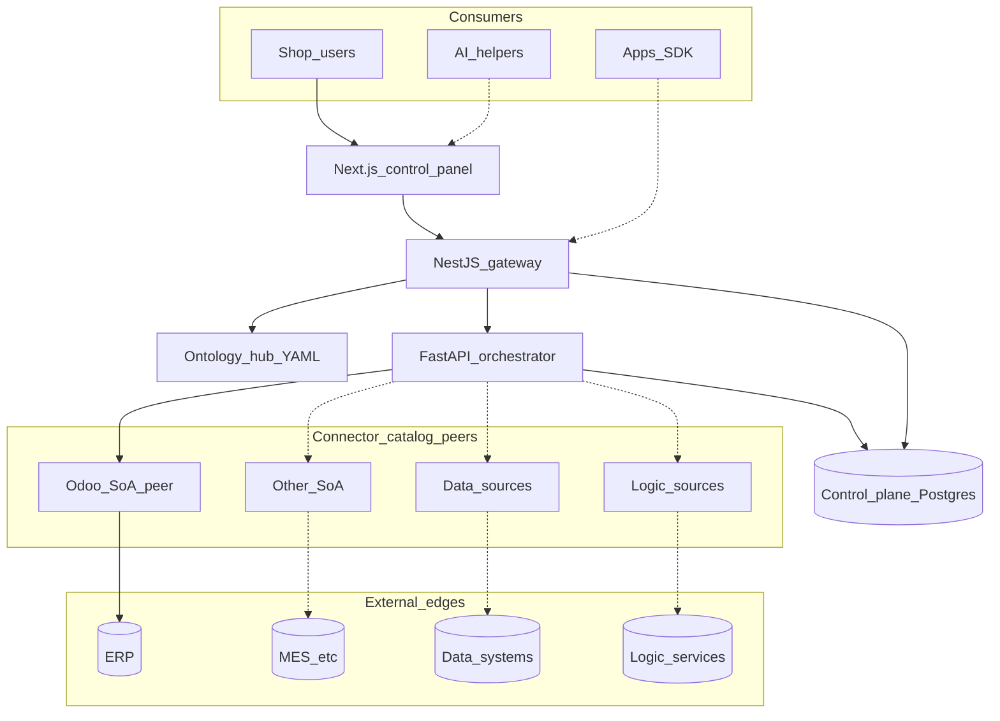
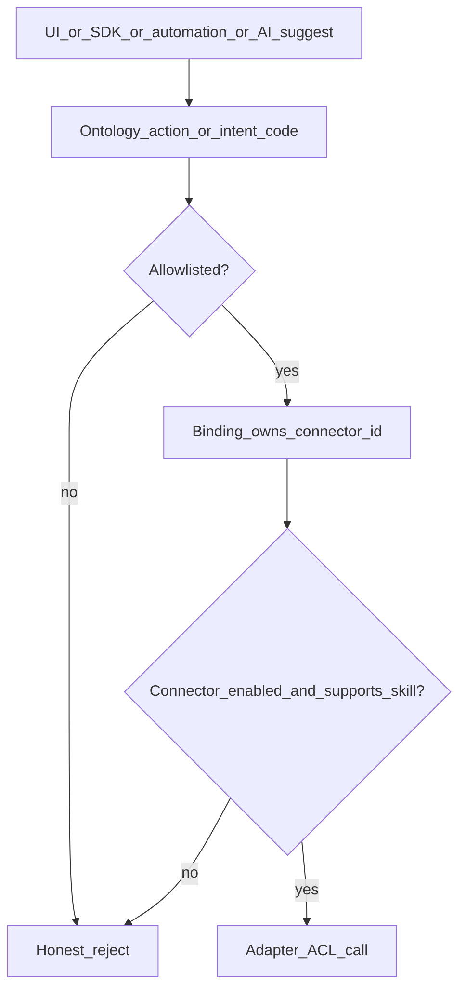

# ControlPanelOntology — Technical System Design (parent TSD)

**Status:** Draft 0.4  
**Pairs with:** [ConOps](../ConOps/ControlPanelOntology_ConOps.md) · [SRD](../SRD/ControlPanelOntology_SRD.md) · [Capability_Model](./Capability_Model.md) · [Pattern_Selection](./Pattern_Selection.md) · [Component_Map](./Component_Map.md)  
**Scenarios:** [SCENARIOS.md](../Subsystem/SCENARIOS.md) (OPS-001…022 external · E-01…08 internal — all **Open** until SRVM)

## 1. Design baseline (from ConOps + SRD)

| Principle | Design consequence |
|-----------|-------------------|
| Ontology is the hub | Types / links / actions live in `resources/packages/ontology`; UI and skills resolve through that catalog |
| Edges are peers | SoA, data, and logic connectors share one **connector catalog SPI**; ERP (Odoo) is SoA peer #1, not a hard-coded sole target |
| Ownership is per binding | `bindings/<connector_id>/` maps properties → vendor fields; public `/ontology*` omits bindings (**SRD-CONN-003**, OPS-022) |
| Governed execution | Ontology action or known intent → allowlisted skill → owning connector (**SRD-ONT-005**, **SRD-SEC-001**) |
| NL / AI classifies only | Classify against taxonomy; execute only via allowlist (**SRD-EDGE-007**, OPS-020) |
| Control plane ≠ edge DB | Compose hosts CP only; edges via env URLs (**SRD-OPS-003**, OPS-007) |

## 2. Picture of the system

Annotated runtime map: [Component_Map](./Component_Map.md).

## 3. Layers

| Layer | Where | Job | Primary SAC |
|-------|-------|-----|-------------|
| UI / analytics surface | `apps/web` | Map, console, ontology tabs, future analytics via gateway only | SAC-002 |
| Gateway (BFF + API face) | `apps/gateway` | Auth stub, PEP allowlist, rate limit, ontology APIs, skills/tasks proxy, SDK entry | SAC-001 |
| Ontology Language | `resources/packages/ontology` | Types, links, actions → skills; bindings per peer | SAC-006 |
| Contracts / taxonomy | `resources/packages/contracts` | Intent / skill codes | SAC-003 |
| Skills engine | `apps/orchestrator` | Facade, ports, evidence; resolves owning connector | SAC-004 |
| Connector catalog | adapters + Integrations UI | SoA / data / logic peers; health; capability matrix | SAC-005 |
| Tasks / automations | gateway Prisma + orch evidence | Queue, dry-run, approve, automation triggers | SAC-007 |
| Runtime | Docker Compose | CP only; edges external | SAC-009 |
| Quality gates | CI + TestPlans | Lint/smokes; release does not close Open scenarios | SAC-010 |

## 4. Key interfaces

| Call | Purpose | SRD / OPS |
|------|---------|-----------|
| `GET /ontology` | List types (no bindings) | SRD-ONT-001 · OPS-004 |
| `GET /ontology/entity-types/:id` | Type detail + actions | SRD-ONT-007 · OPS-004 |
| `GET /ontology/objects` | Explorer objects (Estimate live / demo) | SRD-ONT-008 · SRD-EST-002 · OPS-005 |
| `POST /skills/execute` | Allowlisted skill via owning connector | SRD-SEC-001 · OPS-008, 013 |
| `POST /skills/dry-run` | Preview writes | SRD-SEC-003 · OPS-002 |
| `POST /tasks`, approve/reject | Queue + human gate + automations | SRD-OPS-001 · OPS-003, 018 |
| `POST /intents/classify` | NL/code → known intent only | SRD-EDGE-007 · OPS-010, 020 |
| `GET/PUT /integrations/:id`, `…/test` | Connector config + health | SRD-CONN · OPS-001, 014 |

## 5. Action → skill → connector resolution (SRD-ONT-005)

| Step | Design |
|------|--------|
| Resolve action | Entity YAML `actions[].skill` or taxonomy intent code |
| Enforce | Gateway PEP + orchestrator allowlist (fail closed) |
| Own | Binding / capability matrix → `connector_id` (not hard-coded `odoo`) |
| Execute | Port → adapter for that peer; evidence includes `connector_id` |
| Public API | Business DTOs only (**SRD-SEC-005**) |

Child detail: [SAC-004](../Subsystem/SAC-004/TSD.md) · [SAC-005](../Subsystem/SAC-005/TSD.md) · [SAC-006](../Subsystem/SAC-006/TSD.md).

## 6. Connector catalog SPI (SRD-CONN / SRD-EDGE)

| Rule | Design |
|------|--------|
| Identity | Stable `connector_id` (e.g. `odoo`) |
| Kind | `soa` \| `data` \| `logic` (catalog metadata) |
| Capabilities | Declared skill codes; UI/allowlist gated (**SRD-CONN-004**) |
| Health | `ok` \| `degraded` \| `down` + live/simulate where applicable |
| Bindings | `resources/packages/ontology/bindings/<connector_id>/` — ACL-only |
| Ownership | Per-property / per-binding (**SRD-CONN-003**, OPS-022) |
| Shipping | First-party only — no customer adapter upload (**SRD-CONN-002**) |
| Peers today | `odoo` implemented; other SoA/data/logic = catalog stubs until adapters ship (OPS-014…016 stay Open) |

## 7. Edge families → design allocation

| Family | SRD | OPS | Design home |
|--------|-----|-----|-------------|
| SoA multi-peer action | EDGE-001, ONT-005 | 013 | SAC-004 resolve + SAC-005 catalog |
| Non-ERP SoA config | EDGE-002, CONN-002 | 014 | SAC-005 Integrations (genericize beyond `/odoo`) |
| Data-source bind | EDGE-003 | 015 | SAC-005 + SAC-006 bindings |
| Logic-source invoke | EDGE-004 | 016 | SAC-004 skill → logic adapter |
| Analytics via gateway | UI-004 | 017 | SAC-002 surfaces → SAC-001 only |
| Automation | EDGE-005 | 018 | SAC-007 tasks trigger same skill path |
| SDK / API | EDGE-006 | 019 | SAC-001 public face = gateway |
| AI + human | EDGE-007, SEC-002 | 020 | SAC-003 classify + SAC-001 PEP |
| Process spine | ONT-004 | 021 | SAC-006 Process map |
| Ownership inspect | CONN-003 | 022 | SAC-006 Schema + binding docs/inspector |

## 8. Ontology UI (shipped + residuals)

| Tab | Behavior | OPS |
|-----|----------|-----|
| Schema | Search + inspector; no in-browser YAML edit (v1) | 004, 022 |
| Explorer | Objects; Estimate live via ERP SoA peer | 005 |
| Vertex | Seed + Search Around on declared links | 006 |
| Process map | Curated Estimate→…→Ship spine | 021 |

Residuals: [Risks](../Subsystem/Risks.md) GAP-04…06. Scenarios stay **Open**.

## 9. Modes (ConOps §8 → design)

| Mode | Design touchpoints |
|------|-------------------|
| MODE-01 Browse map | SAC-002 / SAC-006 Schema + Process |
| MODE-02 Explore objects | SAC-006 Explorer / Vertex + skills |
| MODE-03 Execute skill | SAC-001 → SAC-004 → SAC-005 |
| MODE-04 Govern write | SAC-007 dry-run + approve |
| MODE-05 Operate connectors | SAC-005 Integrations |
| MODE-06 Automate | SAC-007 task triggers |
| MODE-07 Integrate | SAC-001 SDK/API |
| MODE-08 AI + human | SAC-003 classify + PEP |

## 10. Child designs (SAC allocation)

| SAC | Design focus | Owns scenarios |
|-----|--------------|----------------|
| [SAC-001](../Subsystem/SAC-001/TSD.md) | Gateway PEP, rate limit, API/SDK face | OPS-012, 019 |
| [SAC-002](../Subsystem/SAC-002/TSD.md) | Map, console, ontology shell, analytics via GW | OPS-009, 017 |
| [SAC-003](../Subsystem/SAC-003/TSD.md) | Taxonomy / contracts; AI classify bounds | OPS-010, 020 |
| [SAC-004](../Subsystem/SAC-004/TSD.md) | Skills facade; multi-peer + logic skills | OPS-008, 013, 016 |
| [SAC-005](../Subsystem/SAC-005/TSD.md) | Connector catalog SPI; Odoo peer; stubs | OPS-001, 014, 015 |
| [SAC-006](../Subsystem/SAC-006/TSD.md) | Ontology hub package + UI tabs | OPS-004…006, 021, 022 |
| [SAC-007](../Subsystem/SAC-007/TSD.md) | Tasks, dry-run, approvals, automations | OPS-002, 003, 018 |
| [SAC-008](../Subsystem/SAC-008/TSD.md) | Estimate-issues wedge on ERP peer | OPS-011 |
| [SAC-009](../Subsystem/SAC-009/TSD.md) | Compose; edges external; deploy/rollback | OPS-007, E-04 |
| [SAC-010](../Subsystem/SAC-010/TSD.md) | CI / release evidence; block on failed V&V | E-05, E-06 (+ E shared) |

Internal E-01…08: [Scenarios/](../Subsystem/Scenarios/) — engineering lifecycle; do not close OPS rows.

## 11. Related

- [Monorepo_Layout](./Monorepo_Layout.md)  
- [SRVM](../SRVM/ControlPanelOntology_SRVM.md)  
- [Risks](../Subsystem/Risks.md)  
