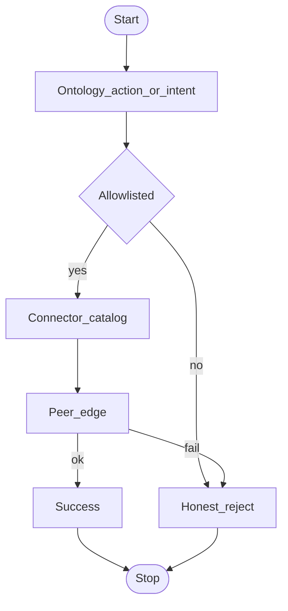
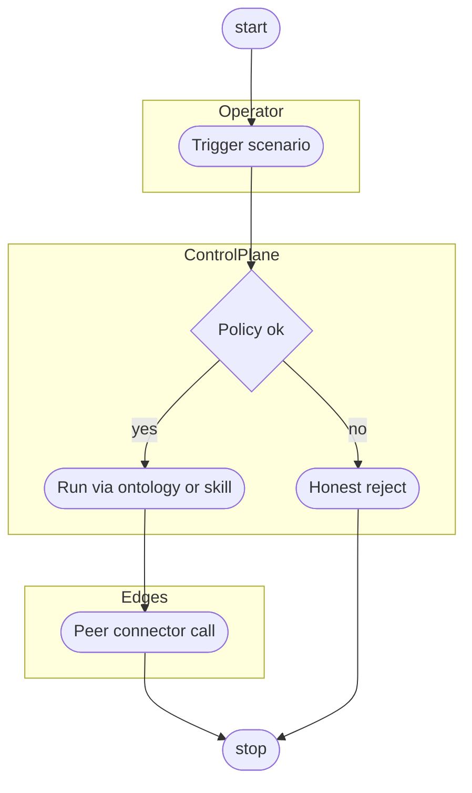
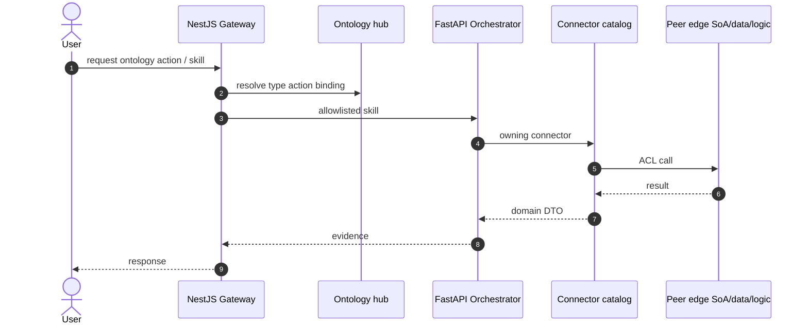
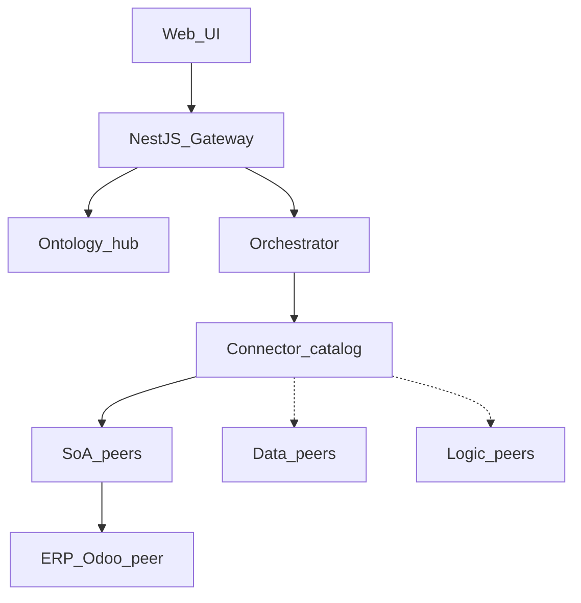

# Issue design diagrams template — ControlPanelOntology

**Template version:** 1.1  
**When:** Before implementing a GitHub issue.  
**Where:** `docs/System_Design/Subsystem/SAC-xxx/Issues/GH-NNN-slug/`

Diagrams must reflect the **ontology hub** and **connector catalog**. **ERP (Odoo) is one SoA peer** — hard-code it only when the issue is the Odoo wedge.

Related scenario stays **Open** until TR + SRVM (issue progress ≠ scenario closure).

---

## README.md

```markdown
# GH-NNN — <title>

| Field | Value |
|-------|--------|
| **GitHub** | https://github.com/llanesleonardo/controlPanelErpOdoo/issues/NNN |
| **Primary SAC** | SAC-xxx |
| **Also involves** | … |
| **Related OPS/E** | OPS-… / E-… (**Open**) |
| **SRD** | SRD-… |
| **Edges** | SoA / data / logic / none |

## Diagrams

| Diagram | File |
|---------|------|
| Flow | [flow.md](flow.md) |
| Activity | [activity.md](activity.md) |
| Sequence | [sequence.md](sequence.md) |
| Class | [class.md](class.md) |

## Scope (from issue)

- …
```

---

## flow.md

End-to-end path (happy path + key failures). Prefer ontology action → skill → owning connector.

````markdown
# GH-NNN — Flow diagram


````

---

## activity.md

UML **activity** semantics. Mermaid `activityDiagram` is **not** supported on GitHub/Cursor — use `flowchart` + swimlanes.

````markdown
# GH-NNN — Activity diagram


````

---

## sequence.md

````markdown
# GH-NNN — Sequence diagram



Note: **ERP (Odoo) is one SoA peer** inside the catalog — not a hard-coded sole target unless this issue is specifically the Odoo wedge.
````

---

## class.md

Prefer a **component** flowchart when UML classes are not yet known.

````markdown
# GH-NNN — Class / component diagram


````

---

*End of issue design diagrams template*
