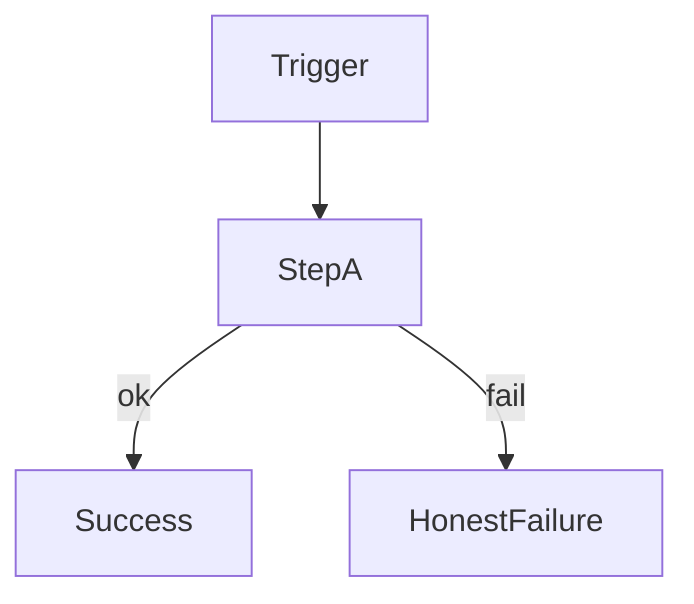

# ConOps Scenario Template

**Document type:** ConOps Scenario (external OPS or internal E)  
**Template version:** 1.1  

One file per scenario. Owned by a **SAC** (or cross-cutting `Subsystem/Scenarios/` for shared E).

```text
ConOps (full story)
  → this scenario file
  → SRD SHALLs / TSD / Test plans / SRVM
```

**Status rule:** default **Open**. Demo/smoke does **not** close the scenario — only TR evidence + SRVM update.

---

## Document control

| Field | Value |
|-------|--------|
| **Scenario ID** | OPS-xxx **or** E-xx |
| **Title** | |
| **Class** | **External** (OPS / product use) **or** **Internal** (E / engineering lifecycle) |
| **Primary subsystem** | SAC-xxx *(or Cross-cutting)* |
| **Also involves** | SAC-… |
| **Related modes** | MODE-… *(OPS)* |
| **Related SRD themes** | SRD-… |
| **Related edges** *(if any)* | SoA / data / logic / none — ERP is a peer, not the hub |
| **Parent ConOps** | link + §9 OPS or §10 E |
| **Version** | 0.1 |
| **Status** | **Open** / Closed *(Closed only with TR + SRVM)* |

### Revision history

| Date | Version | Description | Author(s) |
|------|---------|-------------|-----------|
| | 0.1 | Initial from ConOps | |

---

## 1. Purpose

**One sentence:** what this scenario proves.


---

## 2. Flow diagram

ASCII required; Mermaid optional.

```text
  Trigger
     │
     ▼
  Step A
     │
  ┌──┴──┐
  │ ok  │ fail
  ▼     ▼
  …   Honest failure
```



---

## 3. Classification

| | **OPS — external (product)** | **E — internal (engineering)** |
|--|------------------------------|--------------------------------|
| **Ask** | What happens when someone runs the product? | What happens when we change, prove, or ship? |
| **Actors** | Estimator, admin, automation, SDK, AI+human | Builder, V&V, approver, auditor |
| **GitHub** | `type:impl` | `type:process` |
| **File home** | `SAC-xxx/Scenarios/OPS-*.md` | Owning SAC or `Subsystem/Scenarios/` |

---

## 4. Scenario fields

| Field | Content |
|-------|---------|
| **Actors** | |
| **Preconditions** | |
| **Trigger** | |
| **Normal Flow** | |
| **Alternate Flow** | |
| **Failure Flow** | |
| **System Outputs** | |
| **Stored Evidence** | include `connector_id` when an edge is used |
| **Success Condition** | |

### Engineering narrative *(E only)*

Identify need → ConOps/SRD impact → design → implement → verify → evidence → SRVM → release decision.

---

## 5. Subsystem allocation

| Role | SAC | Notes |
|------|-----|-------|
| **Primary owner** | SAC-xxx | Owns this file |
| **Supporting** | SAC-… | |

Add the ID to that SAC’s `Scenarios/README.md` and `TRACE.md`.

---

## 6. Traceability stubs

| Artifact | Link / ID |
|----------|-----------|
| ConOps section | §9 OPS / §10 E |
| SRD themes | SRD-… |
| Child TSD | `../TSD.md` |
| Pattern selection | [../../TSD/Pattern_Selection.md](../../TSD/Pattern_Selection.md) |
| Risks | [../../Risks.md](../../Risks.md) |
| Test plan | TP-OPS-… / TP-E-… (**Open**) |
| SRVM row | **Open** until TR |

---

## 7. Notes / open questions

- 

---

*End of scenario template*
