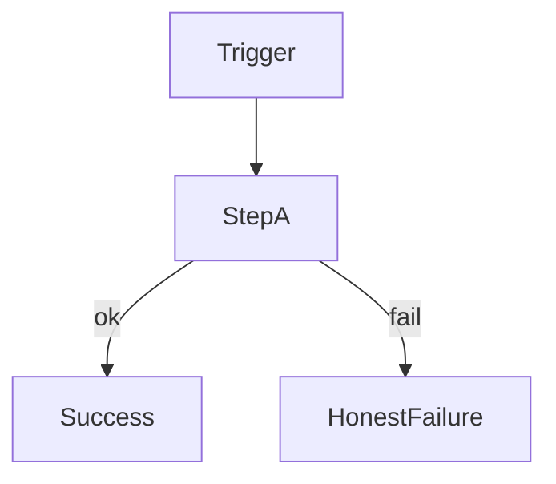

# ConOps Scenario Template

**Document type:** ConOps Scenario (product OPS or engineering E)  
**Template version:** 1.0  

One file per scenario. Keep the same fields as the ConOps so SRD, TSD, and test plans can trace here.

```text
ConOps (full story)  →  this scenario file (owned by a SAC)
                     →  SRD SHALLs / Test plans / SRVM
```

---

## Document control

| Field | Value |
|-------|--------|
| **Scenario ID** | OPS-xxx **or** E-xx |
| **Full ConOps ID** | CONOPS-OPS-xxx **or** Scenario E-xx |
| **Title** | |
| **Class** | Product operational (OPS) / Engineering lifecycle (E) |
| **Primary subsystem** | SAC-xxx |
| **Also involves** | SAC-… *(optional)* |
| **Related modes** | MODE-… *(OPS only, if any)* |
| **Related risks** | RISK-… |
| **Related SRD themes** | SRD-… |
| **Parent ConOps** | link + section |
| **Version** | 0.1 |
| **Updated** | |
| **Status** | Draft / Baseline |

### Revision history

| Date | Version | Description | Author(s) |
|------|---------|-------------|-----------|
| | 0.1 | Initial extract from ConOps | |

---

## 1. Purpose

**In one sentence:** what this scenario proves or exercises.


---

## 2. Flow diagram

ASCII (required) + Mermaid (optional for preview). Show normal, alternate, and failure paths.

```text
  Trigger
     │
     ▼
  Step A
     │
  ┌──┴──┐
  │ ok  │ fail
  ▼     ▼
  …   Honest failure
```



---

## 3. Classification

| | **OPS (product use)** | **E (engineering lifecycle)** |
|--|----------------------|-------------------------------|
| **Ask** | What happens when a user runs the product? | What happens when we change, prove, or ship the system? |
| **Actors** | End User, System, System Administrator | Developer, V&V, approver, auditor |
| **Success** | Correct result + provenance | Evidence-backed closure + approved deploy/release |

---

## 4. Scenario fields

*(Required for OPS. For E scenarios, fill what applies; use N/A where a field is product-only.)*

| Field | Content |
|-------|---------|
| **Actors** | |
| **Preconditions** | |
| **Trigger** | |
| **Normal Flow** | |
| **Alternate Flow** | |
| **Failure Flow** | |
| **System Outputs** | |
| **Stored Evidence** | |
| **Success Condition** | |

### Engineering narrative *(E scenarios — optional short prose)*

Identify need → … → evidence / release decision.

---

## 5. Subsystem allocation

| Role | SAC | Notes |
|------|-----|-------|
| **Primary owner** | SAC-xxx | Owns this scenario file |
| **Supporting** | SAC-… | Interfaces / data / UI |

---

## 6. Traceability stubs

| Artifact | Link / ID |
|----------|-----------|
| ConOps section | |
| Candidate SRD themes | |
| Child TSD | `../TSD.md` or path |
| Pattern selection | [../../TSD/Pattern_Selection.md](../../TSD/Pattern_Selection.md) *(if design-relevant)* |
| Risks | [../Risks.md](../Risks.md) or [../../Risks.md](../../Risks.md) |
| Future test plan | TP-… |
| Future SRVM row | |

---

## 7. Notes / open questions

- 

---

*End of scenario template*
