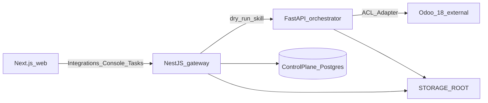

# Epic-04 — Integrations (Odoo connector #1)

## Status

done (Epic-04 phase-01 integrations)

Implements [Epic-01 Phase 04](../Epic-01/phase-04/) integrations: **first-party Odoo connector** settings + health, dry-run execution path through the orchestrator, and control-plane storage/backups. Product framing for multi-connector catalog is locked in [Epic-06](../Epic-06/) / [connectors.md](../../Subsystem/SAC-005/README.md); this epic delivered connector `odoo` only.

**Upstream docs:** Epic-01 Phase 04 (docs-complete)  
**Depends on:** Epic-02 (contracts + Postgres), Epic-03 (gateway, tasks, console, correlation/logs)

## Goal

Stand up a **safe Odoo boundary**: configure and health-check the external SoR, execute **dry-run only** skills via FastAPI orchestrator adapters, and persist evidence under `STORAGE_ROOT` — without free-form Odoo writes and without committing business mutations in this epic.

## Locked defaults

- **Epic id:** `Epic-04` (after ops surfaces Epic-03).
- **Apps:** real `apps/orchestrator` (FastAPI); extend `apps/gateway` + `apps/web`; Odoo remains **external** (not in Compose).
- **Auth:** keep Epic-03 **dev-actor** (`X-Actor-Id`). Full RBAC stays deferred (Epic-01 Phase 02).
- **Commit writes to Odoo:** **out of scope** for Epic-04. `execution_mode=commit` may queue/`needs_approval` as today, but adapters only implement **`simulate` / dry-run**. Live commit skills land in a later epic.
- **Odoo client:** JSON-RPC (`/jsonrpc`) version + authenticate for health; domain adapters behind an **Anti-Corruption Layer**.
- **Offline / no Odoo:** `ODOO_MODE=live|simulate` — `simulate` returns deterministic predicted effects without calling Odoo (local MVP when Odoo is down).
- **Secrets:** store config in control-plane Postgres; API key/password write-only in UI; prefer env fallback (`ODOO_*`). Encryption-at-rest deferred (document threat; do not commit secrets).
- **Patterns first** (project rule): cite chosen patterns in each task TSD.

## Patterns applied (epic-level)

| Concern | Pattern | Doc |
|---------|---------|-----|
| Isolate Odoo from domain | [Anti-Corruption Layer](../../../Software%20Patterns%20Docs/Distributed_system_patterns/15-anti-corruption-layer.md) | ERP boundary translation |
| Ports for simulate vs infra | [Hexagonal Architecture](../../../Software%20Patterns%20Docs/Architectural%20Patterns/05-hexagonal-architecture.md) | Skill core ↔ Odoo adapter |
| JSON-RPC ↔ internal ports | [Adapter](../../../Software%20Patterns%20Docs/Structural%20Patterns/Adapter.md) | Vendor API isolation |
| Orchestrator skill entry | [Facade](../../../Software%20Patterns%20Docs/Structural%20Patterns/Facade.md) | classify→validate→simulate |
| Connector status | [Health Checks](../../../Software%20Patterns%20Docs/DevOps_Delivery_patterns/09-health-checks.md) | ok / degraded / down |
| Protect failing Odoo | [Circuit Breaker](../../../Software%20Patterns%20Docs/Distributed_system_patterns/02-circuit-breaker.md) | open after repeated faults |
| Transient RPC faults | [Retry with Backoff](../../../Software%20Patterns%20Docs/Distributed_system_patterns/04-retry-with-backoff.md) | limited retries on test/simulate |
| Edge BFF (existing) | [API Gateway](../../../Software%20Patterns%20Docs/Distributed_system_patterns/01-api-gateway.md) | gateway proxies orchestrator |
| Trace across services | [Correlation Identifier](../../../Software%20Patterns%20Docs/Messaging_Integration_patterns/19-correlation-identifier.md) | propagate `X-Correlation-Id` |
| Structured evidence | [Observability](../../../Software%20Patterns%20Docs/DevOps_Delivery_patterns/06-observability.md) | logs + task output JSON |

## Phase

| Phase | Focus |
|-------|--------|
| [phase-01](./phase-01/) | Integrations implementation |

## Build order

1. **Storage root helpers + backup script** — evidence landing zone before dry-run artifacts  
2. **Odoo integration config + test** — connector readiness before skills  
3. **Dry-run execution path** — orchestrator + gateway task wiring + console evidence

Instrumentation and correlation from Epic-03 stay mandatory on all new routes.

## Out of scope

- Live Odoo **commit** / mutate business data
- Full SSO/RBAC (Phase 02)
- Multi-company mapping UI, embedding Odoo UI
- Offsite object storage (S3), owning Odoo backups
- ML classification (keep deterministic contracts taxonomy)

## Acceptance

- Epic-04 docs exist with three task packs and pattern citations.
- `/integrations/odoo` configures + tests connector (live or simulate).
- Dry-run tasks call orchestrator, store structured evidence (task output + optional file under `STORAGE_ROOT`).
- Backup script documents/dumps control-plane DB + storage without bundling `.env`.
- `npm run lint` / contracts smoke still pass; no secrets committed.
